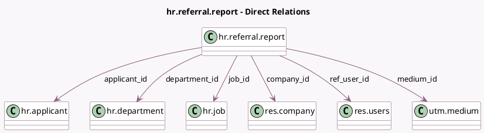

<!-- GENERATED:MODEL -->
---
tags: [odoo, enterprise, generated, model]
---

# hr.referral.report

- Module: [[docs/Enterprise Addons/hr_referral/hr_referral|hr_referral]]
- Scope: Enterprise Addons
- Defined in module: yes
- Source files: `report/hr_referral_report.py`
- Python classes: `HrReferralReport`
- Description: Employee Referral Report

## Field footprint

- Detected fields: 12
- Field types: `Date` x 1, `Integer` x 4, `Many2one` x 6, `Selection` x 1
- Relation fields: 6

## Sample fields

- `applicant_id`: `Many2one` (comodel `hr.applicant`)
- `company_id`: `Many2one` (comodel `res.company`)
- `department_id`: `Many2one` (comodel `hr.department`)
- `earned_points`: `Integer` (comodel `Earned Points`)
- `employee_referral_hired`: `Integer` (comodel `Employee Referral Hired`)
- `employee_referral_refused`: `Integer` (comodel `Employee Referral Refused`)
- `job_id`: `Many2one` (comodel `hr.job`)
- `medium_id`: `Many2one` (comodel `utm.medium`)
- `points_not_hired`: `Integer` (comodel `Points Given For Not Hired`)
- `ref_user_id`: `Many2one` (comodel `res.users`)
- `referral_state`: `Selection`
- `write_date`: `Date`

## Method hints

- Detected methods: 1
- Action methods: none
- Compute methods: none
- Onchange methods: none

## Direct relation diagram

## Navigation

- **Parent:** [[docs/Enterprise Addons/hr_referral/Models]]

<!-- GENERATED:MODEL -->
