<!-- GENERATED:MODEL -->
---
tags: [odoo, enterprise, generated, model]
---

# hr.referral.reward

- Module: [[docs/Enterprise Addons/hr_referral/hr_referral|hr_referral]]
- Scope: Enterprise Addons
- Defined in module: yes
- Source files: `models/hr_referral_reward.py`
- Python classes: `HrReferralReward`
- Description: Reward for Referrals
- Inherits: `mail.activity.mixin`, `mail.thread`

## Field footprint

- Detected fields: 12
- Field types: `Binary` x 2, `Boolean` x 2, `Char` x 1, `Html` x 1, `Integer` x 4, `Many2one` x 2
- Relation fields: 2

## Sample fields

- `active`: `Boolean`
- `awarded_employees`: `Integer` (compute `_compute_awarded_employees`)
- `company_id`: `Many2one` (comodel `res.company`)
- `cost`: `Integer` (comodel `Cost`)
- `description`: `Html`
- `gift_manager_id`: `Many2one` (comodel `res.users`)
- `gift_manager_image`: `Binary` (comodel `Gift Responsible Image`, related `gift_manager_id.image_1024`)
- `image`: `Binary` (comodel `Image`)
- `is_gift_manager`: `Boolean` (compute `_compute_is_gift_manager`)
- `name`: `Char` (comodel `Product Name`)
- `points_missing`: `Integer` (compute `_compute_points_missing`)
- `sequence`: `Integer`

## Method hints

- Detected methods: 9
- Action methods: `action_get_employee_awarded`, `action_open_buy_view`
- Compute methods: `_compute_awarded_employees`, `_compute_is_gift_manager`, `_compute_points_missing`
- Onchange methods: none

## Direct relation diagram

```plantuml
@startuml
!define ODOO_COLOR_PRIMARY #714B67
!define ODOO_COLOR_ACCENT #875A7B
!define ODOO_COLOR_BG #FAF7FA

skinparam backgroundColor ODOO_COLOR_BG
skinparam defaultTextAlignment left
skinparam ArrowColor ODOO_COLOR_ACCENT
skinparam ClassBackgroundColor white
skinparam ClassBorderColor ODOO_COLOR_PRIMARY
skinparam ComponentBackgroundColor white
skinparam ComponentBorderColor ODOO_COLOR_PRIMARY
skinparam NoteBackgroundColor #FFF8FF
skinparam NoteBorderColor ODOO_COLOR_ACCENT
skinparam SequenceLifeLineBorderColor ODOO_COLOR_ACCENT
skinparam SequenceLifeLineBackgroundColor #FFFFFF
skinparam SequenceParticipantBorderColor ODOO_COLOR_PRIMARY
skinparam SequenceParticipantBackgroundColor #FFFFFF
skinparam sequence {
  ArrowColor ODOO_COLOR_ACCENT
  ActorBorderColor ODOO_COLOR_PRIMARY
}
title hr.referral.reward - Direct Relations
class "hr.referral.reward" as hr_referral_reward
class "res.company" as res_company
class "res.users" as res_users
hr_referral_reward --> res_users : gift_manager_id
hr_referral_reward --> res_company : company_id
@enduml
```

## Navigation

- **Parent:** [[docs/Enterprise Addons/hr_referral/Models]]

<!-- GENERATED:MODEL -->
