<!-- GENERATED:MODEL -->
---
tags: [odoo, enterprise, generated, model]
---

# hr.referral.send.mail

- Module: [[docs/Enterprise Addons/hr_referral/hr_referral|hr_referral]]
- Scope: Enterprise Addons
- Defined in module: yes
- Source files: `wizard/hr_referral_send_mail.py`
- Python classes: `HrReferralSendMail`
- Description: Referral Send Mail

## Field footprint

- Detected fields: 5
- Field types: `Char` x 3, `Html` x 1, `Many2one` x 1
- Relation fields: 1

## Sample fields

- `body_html`: `Html` (comodel `Body`, compute `_compute_body_html`, store `True`)
- `email_to`: `Char`
- `job_id`: `Many2one` (comodel `hr.job`)
- `subject`: `Char` (comodel `Subject`)
- `url`: `Char` (compute `_compute_url`)

## Method hints

- Detected methods: 3
- Action methods: none
- Compute methods: `_compute_body_html`, `_compute_url`
- Onchange methods: none

## Direct relation diagram

```plantuml
@startuml
!define ODOO_COLOR_PRIMARY #714B67
!define ODOO_COLOR_ACCENT #875A7B
!define ODOO_COLOR_BG #FAF7FA

skinparam backgroundColor ODOO_COLOR_BG
skinparam defaultTextAlignment left
skinparam ArrowColor ODOO_COLOR_ACCENT
skinparam ClassBackgroundColor white
skinparam ClassBorderColor ODOO_COLOR_PRIMARY
skinparam ComponentBackgroundColor white
skinparam ComponentBorderColor ODOO_COLOR_PRIMARY
skinparam NoteBackgroundColor #FFF8FF
skinparam NoteBorderColor ODOO_COLOR_ACCENT
skinparam SequenceLifeLineBorderColor ODOO_COLOR_ACCENT
skinparam SequenceLifeLineBackgroundColor #FFFFFF
skinparam SequenceParticipantBorderColor ODOO_COLOR_PRIMARY
skinparam SequenceParticipantBackgroundColor #FFFFFF
skinparam sequence {
  ArrowColor ODOO_COLOR_ACCENT
  ActorBorderColor ODOO_COLOR_PRIMARY
}
title hr.referral.send.mail - Direct Relations
class "hr.referral.send.mail" as hr_referral_send_mail
class "hr.job" as hr_job
hr_referral_send_mail --> hr_job : job_id
@enduml
```

## Navigation

- **Parent:** [[docs/Enterprise Addons/hr_referral/Models]]

<!-- GENERATED:MODEL -->
