<!-- GENERATED:MODEL -->
---
tags: [odoo, enterprise, generated, model]
---

# res.users

- Module: [[docs/Enterprise Addons/hr_referral/hr_referral|hr_referral]]
- Scope: Enterprise Addons
- Defined in module: extension only
- Source files: `models/res_users.py`
- Python classes: `ResUsers`

## Field footprint

- Detected fields: 4
- Field types: `Boolean` x 1, `Many2one` x 2, `One2many` x 1
- Relation fields: 3

## Sample fields

- `hr_referral_level_id`: `Many2one` (comodel `hr.referral.level`)
- `hr_referral_onboarding_page`: `Boolean`
- `referral_point_ids`: `One2many` (comodel `hr.referral.points`)
- `utm_source_id`: `Many2one` (comodel `utm.source`)

## Method hints

- Detected methods: 3
- Action methods: `action_complete_onboarding`
- Compute methods: none
- Onchange methods: none

## Direct relation diagram

```plantuml
@startuml
!define ODOO_COLOR_PRIMARY #714B67
!define ODOO_COLOR_ACCENT #875A7B
!define ODOO_COLOR_BG #FAF7FA

skinparam backgroundColor ODOO_COLOR_BG
skinparam defaultTextAlignment left
skinparam ArrowColor ODOO_COLOR_ACCENT
skinparam ClassBackgroundColor white
skinparam ClassBorderColor ODOO_COLOR_PRIMARY
skinparam ComponentBackgroundColor white
skinparam ComponentBorderColor ODOO_COLOR_PRIMARY
skinparam NoteBackgroundColor #FFF8FF
skinparam NoteBorderColor ODOO_COLOR_ACCENT
skinparam SequenceLifeLineBorderColor ODOO_COLOR_ACCENT
skinparam SequenceLifeLineBackgroundColor #FFFFFF
skinparam SequenceParticipantBorderColor ODOO_COLOR_PRIMARY
skinparam SequenceParticipantBackgroundColor #FFFFFF
skinparam sequence {
  ArrowColor ODOO_COLOR_ACCENT
  ActorBorderColor ODOO_COLOR_PRIMARY
}
title res.users - Direct Relations
class "res.users" as res_users
class "hr.referral.level" as hr_referral_level
class "hr.referral.points" as hr_referral_points
class "utm.source" as utm_source
res_users --> hr_referral_level : hr_referral_level_id
res_users --|> hr_referral_points : referral_point_ids
res_users --> utm_source : utm_source_id
@enduml
```

## Navigation

- **Parent:** [[docs/Enterprise Addons/hr_referral/Models]]

<!-- GENERATED:MODEL -->
