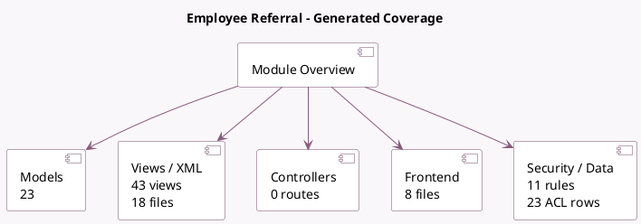

<!-- GENERATED:MODULE -->
---
tags: [odoo, enterprise, module]
---

# Employee Referral

- Scope: Enterprise Addons
- Source: enterprise/hr_referral
- Dependencies: [[docs/Community Addons/hr_recruitment/hr_recruitment|hr_recruitment]], [[docs/Community Addons/link_tracker/link_tracker|link_tracker]], [[docs/Community Addons/website_hr_recruitment/website_hr_recruitment|website_hr_recruitment]], [[docs/Enterprise Addons/hr_recruitment_reports/hr_recruitment_reports|hr_recruitment_reports]]

## Summary

Let your employees share job positions and refer their friends

## Generated coverage

- Models: 23
- XML files with UI/data artifacts: 18
- Views: 43
- Actions: 22
- Menus: 14
- Rules (ir.rule): 11
- Access CSV entries: 23
- Controller units: 0
- Frontend asset files: 8

## Module map

## Detail notes

- Models: [[docs/Enterprise Addons/hr_referral/Models|Models]] (23)
- Views and XML: [[docs/Enterprise Addons/hr_referral/Views|Views]] (18 files)
- Frontend: [[docs/Enterprise Addons/hr_referral/Frontend|Frontend]] (8 files)

## Key models

- `applicant.get.refuse.reason`
- `hr.applicant`
- `hr.job`
- `hr.recruitment.report`
- `hr.recruitment.stage`
- `hr.referral.alert`
- `hr.referral.alert.mail.wizard`
- `hr.referral.campaign.wizard`
- `hr.referral.friend`
- `hr.referral.level`
- `hr.referral.link.to.share`
- `hr.referral.onboarding`

## Navigation

- [[../Enterprise Addons/Enterprise Addons|Back to scope]]
- [[../../docs/docs|Back to docs]]

<!-- GENERATED:MODULE -->

