<!-- GENERATED:MODEL -->
---
tags: [odoo, enterprise, generated, model]
---

# hr.contract.sign.document.wizard

- Module: [[docs/Enterprise Addons/hr_sign/hr_sign|hr_sign]]
- Scope: Enterprise Addons
- Defined in module: yes
- Source files: `wizard/hr_contract_sign_document_wizard.py`
- Python classes: `HrContractSignDocumentWizard`
- Description: Sign document in contract

## Field footprint

- Detected fields: 15
- Field types: `Boolean` x 1, `Char` x 3, `Html` x 1, `Many2many` x 6, `Many2one` x 3, `Selection` x 1
- Relation fields: 9

## Sample fields

- `attachment_ids`: `Many2many` (comodel `ir.attachment`)
- `cc_partner_ids`: `Many2many` (comodel `res.partner`)
- `employee_ids`: `Many2many` (comodel `hr.employee`, compute `_compute_employee_ids`, store `True`)
- `employee_role_id`: `Many2one` (comodel `sign.item.role`, compute `_compute_employee_role_id`, store `True`)
- `has_both_template`: `Boolean` (compute `_compute_has_both_template`)
- `mail_displayed`: `Char` (compute `_compute_mail_displayed`)
- `mail_to`: `Selection`
- `message`: `Html` (comodel `Message`)
- `possible_template_ids`: `Many2many` (comodel `sign.template`, compute `_compute_possible_template_ids`)
- `responsible_id`: `Many2one` (comodel `res.users`)
- `sign_template_ids`: `Many2many` (comodel `sign.template`)
- `sign_template_responsible_ids`: `Many2many` (comodel `sign.item.role`, compute `_compute_responsible_ids`)
- `subject`: `Char`
- `template_warning`: `Char` (store `False`)
- `version_id`: `Many2one` (comodel `hr.version`, compute `_compute_contract_id`, store `True`)

## Method hints

- Detected methods: 12
- Action methods: none
- Compute methods: `_compute_contract_id`, `_compute_employee_ids`, `_compute_employee_role_id`, `_compute_has_both_template`, `_compute_mail_displayed`, `_compute_possible_template_ids`, `_compute_responsible_ids`
- Onchange methods: none

## Direct relation diagram

```plantuml
@startuml
!define ODOO_COLOR_PRIMARY #714B67
!define ODOO_COLOR_ACCENT #875A7B
!define ODOO_COLOR_BG #FAF7FA

skinparam backgroundColor ODOO_COLOR_BG
skinparam defaultTextAlignment left
skinparam ArrowColor ODOO_COLOR_ACCENT
skinparam ClassBackgroundColor white
skinparam ClassBorderColor ODOO_COLOR_PRIMARY
skinparam ComponentBackgroundColor white
skinparam ComponentBorderColor ODOO_COLOR_PRIMARY
skinparam NoteBackgroundColor #FFF8FF
skinparam NoteBorderColor ODOO_COLOR_ACCENT
skinparam SequenceLifeLineBorderColor ODOO_COLOR_ACCENT
skinparam SequenceLifeLineBackgroundColor #FFFFFF
skinparam SequenceParticipantBorderColor ODOO_COLOR_PRIMARY
skinparam SequenceParticipantBackgroundColor #FFFFFF
skinparam sequence {
  ArrowColor ODOO_COLOR_ACCENT
  ActorBorderColor ODOO_COLOR_PRIMARY
}
title hr.contract.sign.document.wizard - Direct Relations
class "hr.contract.sign.document.wizard" as hr_contract_sign_document_wizard
class "hr.employee" as hr_employee
class "hr.version" as hr_version
class "ir.attachment" as ir_attachment
class "res.partner" as res_partner
class "res.users" as res_users
class "sign.item.role" as sign_item_role
class "sign.template" as sign_template
hr_contract_sign_document_wizard --> hr_version : version_id
hr_contract_sign_document_wizard .. hr_employee : employee_ids
hr_contract_sign_document_wizard --> res_users : responsible_id
hr_contract_sign_document_wizard --> sign_item_role : employee_role_id
hr_contract_sign_document_wizard .. sign_item_role : sign_template_responsible_ids
hr_contract_sign_document_wizard .. sign_template : possible_template_ids
hr_contract_sign_document_wizard .. sign_template : sign_template_ids
hr_contract_sign_document_wizard .. res_partner : cc_partner_ids
hr_contract_sign_document_wizard .. ir_attachment : attachment_ids
@enduml
```

## Navigation

- **Parent:** [[docs/Enterprise Addons/hr_sign/Models]]

<!-- GENERATED:MODEL -->
