<!-- GENERATED:MODEL -->
---
tags: [odoo, enterprise, generated, model]
---

# mail.activity.plan.template

- Module: [[docs/Enterprise Addons/hr_sign/hr_sign|hr_sign]]
- Scope: Enterprise Addons
- Defined in module: extension only
- Source files: `models/mail_activity_plan_template.py`
- Python classes: `MailActivityPlanTemplate`

## Field footprint

- Detected fields: 5
- Field types: `Boolean` x 1, `Integer` x 1, `Many2many` x 1, `Many2one` x 2
- Relation fields: 3

## Sample fields

- `employee_role_id`: `Many2one` (comodel `sign.item.role`, compute `_compute_employee_role_id`, store `True`)
- `is_signature_request`: `Boolean` (compute `_compute_signature_request`)
- `responsible_count`: `Integer` (compute `_compute_responsible_ids`)
- `sign_template_id`: `Many2one` (comodel `sign.template`)
- `sign_template_responsible_ids`: `Many2many` (comodel `sign.item.role`, compute `_compute_responsible_ids`)

## Method hints

- Detected methods: 3
- Action methods: none
- Compute methods: `_compute_employee_role_id`, `_compute_responsible_ids`, `_compute_signature_request`
- Onchange methods: none

## Direct relation diagram

```plantuml
@startuml
!define ODOO_COLOR_PRIMARY #714B67
!define ODOO_COLOR_ACCENT #875A7B
!define ODOO_COLOR_BG #FAF7FA

skinparam backgroundColor ODOO_COLOR_BG
skinparam defaultTextAlignment left
skinparam ArrowColor ODOO_COLOR_ACCENT
skinparam ClassBackgroundColor white
skinparam ClassBorderColor ODOO_COLOR_PRIMARY
skinparam ComponentBackgroundColor white
skinparam ComponentBorderColor ODOO_COLOR_PRIMARY
skinparam NoteBackgroundColor #FFF8FF
skinparam NoteBorderColor ODOO_COLOR_ACCENT
skinparam SequenceLifeLineBorderColor ODOO_COLOR_ACCENT
skinparam SequenceLifeLineBackgroundColor #FFFFFF
skinparam SequenceParticipantBorderColor ODOO_COLOR_PRIMARY
skinparam SequenceParticipantBackgroundColor #FFFFFF
skinparam sequence {
  ArrowColor ODOO_COLOR_ACCENT
  ActorBorderColor ODOO_COLOR_PRIMARY
}
title mail.activity.plan.template - Direct Relations
class "mail.activity.plan.template" as mail_activity_plan_template
class "sign.item.role" as sign_item_role
class "sign.template" as sign_template
mail_activity_plan_template --> sign_template : sign_template_id
mail_activity_plan_template --> sign_item_role : employee_role_id
mail_activity_plan_template .. sign_item_role : sign_template_responsible_ids
@enduml
```

## Navigation

- **Parent:** [[docs/Enterprise Addons/hr_sign/Models]]

<!-- GENERATED:MODEL -->
