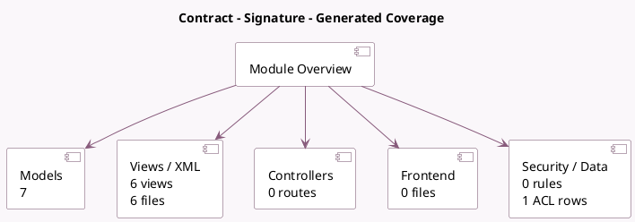

<!-- GENERATED:MODULE -->
---
tags: [odoo, enterprise, module]
---

# Contract - Signature

- Scope: Enterprise Addons
- Source: enterprise/hr_sign
- Dependencies: [[docs/Community Addons/hr/hr|hr]], [[docs/Enterprise Addons/sign/sign|sign]]

## Summary

Manage your documents to sign in contracts

## Generated coverage

- Models: 7
- XML files with UI/data artifacts: 6
- Views: 6
- Actions: 2
- Menus: 0
- Rules (ir.rule): 0
- Access CSV entries: 1
- Controller units: 0
- Frontend asset files: 0

## Module map

## Detail notes

- Models: [[docs/Enterprise Addons/hr_sign/Models|Models]] (7)
- Views and XML: [[docs/Enterprise Addons/hr_sign/Views|Views]] (6 files)

## Key models

- `hr.contract.sign.document.wizard`
- `hr.employee`
- `hr.employee.public`
- `hr.version`
- `mail.activity.plan.template`
- `mail.activity.schedule`
- `res.users`

## Navigation

- [[../Enterprise Addons/Enterprise Addons|Back to scope]]
- [[../../docs/docs|Back to docs]]

<!-- GENERATED:MODULE -->

