<!-- GENERATED:MODEL -->
---
tags: [odoo, enterprise, generated, model]
---

# hr.attendance.overtime.rule

- Module: [[docs/Enterprise Addons/hr_work_entry_attendance/hr_work_entry_attendance|hr_work_entry_attendance]]
- Scope: Enterprise Addons
- Defined in module: yes
- Source files: `models/hr_attendance_overtime_rule.py`
- Python classes: `HrAttendanceOvertimeRule`

## Field footprint

- Detected fields: 2
- Field types: `Float` x 1, `Many2one` x 1
- Relation fields: 1

## Sample fields

- `amount_rate`: `Float` (comodel `Salary Rate`, compute `_compute_amount_rate`, store `True`)
- `work_entry_type_id`: `Many2one` (comodel `hr.work.entry.type`)

## Method hints

- Detected methods: 3
- Action methods: none
- Compute methods: `_compute_amount_rate`
- Onchange methods: none

## Direct relation diagram

```plantuml
@startuml
!define ODOO_COLOR_PRIMARY #714B67
!define ODOO_COLOR_ACCENT #875A7B
!define ODOO_COLOR_BG #FAF7FA

skinparam backgroundColor ODOO_COLOR_BG
skinparam defaultTextAlignment left
skinparam ArrowColor ODOO_COLOR_ACCENT
skinparam ClassBackgroundColor white
skinparam ClassBorderColor ODOO_COLOR_PRIMARY
skinparam ComponentBackgroundColor white
skinparam ComponentBorderColor ODOO_COLOR_PRIMARY
skinparam NoteBackgroundColor #FFF8FF
skinparam NoteBorderColor ODOO_COLOR_ACCENT
skinparam SequenceLifeLineBorderColor ODOO_COLOR_ACCENT
skinparam SequenceLifeLineBackgroundColor #FFFFFF
skinparam SequenceParticipantBorderColor ODOO_COLOR_PRIMARY
skinparam SequenceParticipantBackgroundColor #FFFFFF
skinparam sequence {
  ArrowColor ODOO_COLOR_ACCENT
  ActorBorderColor ODOO_COLOR_PRIMARY
}
title hr.attendance.overtime.rule - Direct Relations
class "hr.attendance.overtime.rule" as hr_attendance_overtime_rule
class "hr.work.entry.type" as hr_work_entry_type
hr_attendance_overtime_rule --> hr_work_entry_type : work_entry_type_id
@enduml
```

## Navigation

- **Parent:** [[docs/Enterprise Addons/hr_work_entry_attendance/Models]]

<!-- GENERATED:MODEL -->
