<!-- GENERATED:MODEL -->
---
tags: [odoo, enterprise, generated, model]
---

# extract.mixin.with.words

- Module: [[docs/Enterprise Addons/iap_extract/iap_extract|iap_extract]]
- Scope: Enterprise Addons
- Defined in module: yes
- Source files: `models/extract_mixin_with_words.py`
- Python classes: `ExtractMixinWithWords`
- Description: Base class to extract data from documents with OCRed words saved
- Inherits: `extract.mixin`

## Field footprint

- Detected fields: 4
- Field types: `Json` x 3, `Many2one` x 1
- Relation fields: 1

## Sample fields

- `extract_attachment_id`: `Many2one` (comodel `ir.attachment`)
- `extracted_dates`: `Json`
- `extracted_numbers`: `Json`
- `extracted_words`: `Json`

## Method hints

- Detected methods: 4
- Action methods: none
- Compute methods: none
- Onchange methods: none

## Direct relation diagram

```plantuml
@startuml
!define ODOO_COLOR_PRIMARY #714B67
!define ODOO_COLOR_ACCENT #875A7B
!define ODOO_COLOR_BG #FAF7FA

skinparam backgroundColor ODOO_COLOR_BG
skinparam defaultTextAlignment left
skinparam ArrowColor ODOO_COLOR_ACCENT
skinparam ClassBackgroundColor white
skinparam ClassBorderColor ODOO_COLOR_PRIMARY
skinparam ComponentBackgroundColor white
skinparam ComponentBorderColor ODOO_COLOR_PRIMARY
skinparam NoteBackgroundColor #FFF8FF
skinparam NoteBorderColor ODOO_COLOR_ACCENT
skinparam SequenceLifeLineBorderColor ODOO_COLOR_ACCENT
skinparam SequenceLifeLineBackgroundColor #FFFFFF
skinparam SequenceParticipantBorderColor ODOO_COLOR_PRIMARY
skinparam SequenceParticipantBackgroundColor #FFFFFF
skinparam sequence {
  ArrowColor ODOO_COLOR_ACCENT
  ActorBorderColor ODOO_COLOR_PRIMARY
}
title extract.mixin.with.words - Direct Relations
class "extract.mixin.with.words" as extract_mixin_with_words
class "ir.attachment" as ir_attachment
extract_mixin_with_words --> ir_attachment : extract_attachment_id
@enduml
```

## Navigation

- **Parent:** [[docs/Enterprise Addons/iap_extract/Models]]

<!-- GENERATED:MODEL -->
