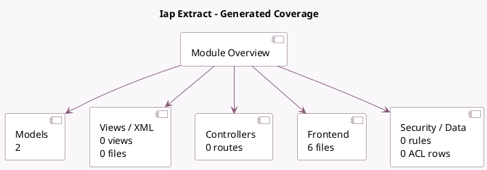

<!-- GENERATED:MODULE -->
---
tags: [odoo, enterprise, module]
---

# Iap Extract

- Scope: Enterprise Addons
- Source: enterprise/iap_extract
- Dependencies: base (not documented), [[docs/Community Addons/iap/iap|iap]], [[docs/Community Addons/mail/mail|mail]], [[docs/Community Addons/iap_mail/iap_mail|iap_mail]]

## Summary

Common module for requesting data from the extract server

## Generated coverage

- Models: 2
- XML files with UI/data artifacts: 0
- Views: 0
- Actions: 0
- Menus: 0
- Rules (ir.rule): 0
- Access CSV entries: 0
- Controller units: 0
- Frontend asset files: 6

## Module map

## Detail notes

- Models: [[docs/Enterprise Addons/iap_extract/Models|Models]] (2)
- Frontend: [[docs/Enterprise Addons/iap_extract/Frontend|Frontend]] (6 files)

## Key models

- `extract.mixin`
- `extract.mixin.with.words`

## Navigation

- [[../Enterprise Addons/Enterprise Addons|Back to scope]]
- [[../../docs/docs|Back to docs]]

<!-- GENERATED:MODULE -->

