<!-- GENERATED:MODEL -->
---
tags: [odoo, enterprise, generated, model]
---

# project.task

- Module: [[docs/Enterprise Addons/industry_fsm/industry_fsm|industry_fsm]]
- Scope: Enterprise Addons
- Defined in module: extension only
- Source files: `models/project_task.py`
- Python classes: `ProjectTask`

## Field footprint

- Detected fields: 22
- Field types: `Binary` x 1, `Boolean` x 12, `Char` x 5, `Integer` x 2, `Many2one` x 2
- Relation fields: 2

## Sample fields

- `allow_geolocation`: `Boolean` (related `project_id.allow_geolocation`)
- `display_enabled_conditions_count`: `Integer` (compute `_compute_display_conditions_count`)
- `display_mark_as_done_primary`: `Boolean` (compute `_compute_mark_as_done_buttons`)
- `display_mark_as_done_secondary`: `Boolean` (compute `_compute_mark_as_done_buttons`)
- `display_satisfied_conditions_count`: `Integer` (compute `_compute_display_conditions_count`)
- `display_send_report_primary`: `Boolean` (compute `_compute_display_send_report_buttons`)
- `display_send_report_secondary`: `Boolean` (compute `_compute_display_send_report_buttons`)
- `display_sign_report_primary`: `Boolean` (compute `_compute_display_sign_report_buttons`)
- `display_sign_report_secondary`: `Boolean` (compute `_compute_display_sign_report_buttons`)
- `fsm_done`: `Boolean` (comodel `Task Done`, compute `_compute_fsm_done`, store `True`)
- `fsm_is_sent`: `Boolean`
- `is_fsm`: `Boolean` (related `project_id.is_fsm`)
- `is_task_phone_update`: `Boolean` (compute `_compute_is_task_phone_update`)
- `partner_city`: `Char` (related `partner_id.city`)
- `partner_country_id`: `Many2one` (comodel `res.country`, related `partner_id.country_id`)
- `partner_state_id`: `Many2one` (comodel `res.country.state`, related `partner_id.state_id`)
- `partner_street`: `Char` (related `partner_id.street`)
- `partner_street2`: `Char` (related `partner_id.street2`)
- `partner_zip`: `Char` (related `partner_id.zip`)
- `show_customer_preview`: `Boolean` (compute `_compute_show_customer_preview`)

## Method hints

- Detected methods: 34
- Action methods: `action_fsm_navigate`, `action_fsm_validate`, `action_fsm_view_overlapping_tasks`, `action_preview_worksheet`, `action_send_report`, `action_timer_start`, `action_view_timesheets`
- Compute methods: `_compute_display_conditions_count`, `_compute_display_send_report_buttons`, `_compute_display_sign_report_buttons`, `_compute_display_timesheet_timer`, `_compute_fsm_done`, `_compute_is_task_phone_update`, `_compute_mark_as_done_buttons`, `_compute_planning_overlap`, and 1 more
- Onchange methods: `_onchange_planned_dates`

## Direct relation diagram

```plantuml
@startuml
!define ODOO_COLOR_PRIMARY #714B67
!define ODOO_COLOR_ACCENT #875A7B
!define ODOO_COLOR_BG #FAF7FA

skinparam backgroundColor ODOO_COLOR_BG
skinparam defaultTextAlignment left
skinparam ArrowColor ODOO_COLOR_ACCENT
skinparam ClassBackgroundColor white
skinparam ClassBorderColor ODOO_COLOR_PRIMARY
skinparam ComponentBackgroundColor white
skinparam ComponentBorderColor ODOO_COLOR_PRIMARY
skinparam NoteBackgroundColor #FFF8FF
skinparam NoteBorderColor ODOO_COLOR_ACCENT
skinparam SequenceLifeLineBorderColor ODOO_COLOR_ACCENT
skinparam SequenceLifeLineBackgroundColor #FFFFFF
skinparam SequenceParticipantBorderColor ODOO_COLOR_PRIMARY
skinparam SequenceParticipantBackgroundColor #FFFFFF
skinparam sequence {
  ArrowColor ODOO_COLOR_ACCENT
  ActorBorderColor ODOO_COLOR_PRIMARY
}
title project.task - Direct Relations
class "project.task" as project_task
class "res.country" as res_country
class "res.country.state" as res_country_state
project_task --> res_country : partner_country_id
project_task --> res_country_state : partner_state_id
@enduml
```

## Navigation

- **Parent:** [[docs/Enterprise Addons/industry_fsm/Models]]

<!-- GENERATED:MODEL -->
