<!-- GENERATED:MODEL -->
---
tags: [odoo, enterprise, generated, model]
---

# project.task.stop.timers.wizard

- Module: [[docs/Enterprise Addons/industry_fsm/industry_fsm|industry_fsm]]
- Scope: Enterprise Addons
- Defined in module: yes
- Source files: `wizard/task_stop_timer_confirmation_wizard.py`
- Python classes: `ProjectTaskStopTimersWizard`
- Description: Task stop running timers confirmation wizard

## Field footprint

- Detected fields: 1
- Field types: `One2many` x 1
- Relation fields: 1

## Sample fields

- `line_ids`: `One2many` (comodel `project.task.stop.timers.wizard.line`)

## Method hints

- Detected methods: 1
- Action methods: `action_confirm`
- Compute methods: none
- Onchange methods: none

## Direct relation diagram

```plantuml
@startuml
!define ODOO_COLOR_PRIMARY #714B67
!define ODOO_COLOR_ACCENT #875A7B
!define ODOO_COLOR_BG #FAF7FA

skinparam backgroundColor ODOO_COLOR_BG
skinparam defaultTextAlignment left
skinparam ArrowColor ODOO_COLOR_ACCENT
skinparam ClassBackgroundColor white
skinparam ClassBorderColor ODOO_COLOR_PRIMARY
skinparam ComponentBackgroundColor white
skinparam ComponentBorderColor ODOO_COLOR_PRIMARY
skinparam NoteBackgroundColor #FFF8FF
skinparam NoteBorderColor ODOO_COLOR_ACCENT
skinparam SequenceLifeLineBorderColor ODOO_COLOR_ACCENT
skinparam SequenceLifeLineBackgroundColor #FFFFFF
skinparam SequenceParticipantBorderColor ODOO_COLOR_PRIMARY
skinparam SequenceParticipantBackgroundColor #FFFFFF
skinparam sequence {
  ArrowColor ODOO_COLOR_ACCENT
  ActorBorderColor ODOO_COLOR_PRIMARY
}
title project.task.stop.timers.wizard - Direct Relations
class "project.task.stop.timers.wizard" as project_task_stop_timers_wizard
class "project.task.stop.timers.wizard.line" as project_task_stop_timers_wizard_line
project_task_stop_timers_wizard --|> project_task_stop_timers_wizard_line : line_ids
@enduml
```

## Navigation

- **Parent:** [[docs/Enterprise Addons/industry_fsm/Models]]

<!-- GENERATED:MODEL -->
