<!-- GENERATED:MODEL -->
---
tags: [odoo, enterprise, generated, model]
---

# report.project.task.user.fsm

- Module: [[docs/Enterprise Addons/industry_fsm/industry_fsm|industry_fsm]]
- Scope: Enterprise Addons
- Defined in module: yes
- Source files: `report/project_report.py`
- Python classes: `ReportProjectTaskUserFsm`
- Description: FSM Tasks Analysis
- Inherits: `report.project.task.user`

## Field footprint

- Detected fields: 6
- Field types: `Char` x 4, `Many2one` x 2
- Relation fields: 2

## Sample fields

- `partner_city`: `Char`
- `partner_country_id`: `Many2one` (comodel `res.country`)
- `partner_state_id`: `Many2one` (comodel `res.country.state`)
- `partner_street`: `Char`
- `partner_street2`: `Char`
- `partner_zip`: `Char`

## Method hints

- Detected methods: 3
- Action methods: none
- Compute methods: none
- Onchange methods: none

## Direct relation diagram

```plantuml
@startuml
!define ODOO_COLOR_PRIMARY #714B67
!define ODOO_COLOR_ACCENT #875A7B
!define ODOO_COLOR_BG #FAF7FA

skinparam backgroundColor ODOO_COLOR_BG
skinparam defaultTextAlignment left
skinparam ArrowColor ODOO_COLOR_ACCENT
skinparam ClassBackgroundColor white
skinparam ClassBorderColor ODOO_COLOR_PRIMARY
skinparam ComponentBackgroundColor white
skinparam ComponentBorderColor ODOO_COLOR_PRIMARY
skinparam NoteBackgroundColor #FFF8FF
skinparam NoteBorderColor ODOO_COLOR_ACCENT
skinparam SequenceLifeLineBorderColor ODOO_COLOR_ACCENT
skinparam SequenceLifeLineBackgroundColor #FFFFFF
skinparam SequenceParticipantBorderColor ODOO_COLOR_PRIMARY
skinparam SequenceParticipantBackgroundColor #FFFFFF
skinparam sequence {
  ArrowColor ODOO_COLOR_ACCENT
  ActorBorderColor ODOO_COLOR_PRIMARY
}
title report.project.task.user.fsm - Direct Relations
class "report.project.task.user.fsm" as report_project_task_user_fsm
class "res.country" as res_country
class "res.country.state" as res_country_state
report_project_task_user_fsm --> res_country : partner_country_id
report_project_task_user_fsm --> res_country_state : partner_state_id
@enduml
```

## Navigation

- **Parent:** [[docs/Enterprise Addons/industry_fsm/Models]]

<!-- GENERATED:MODEL -->
