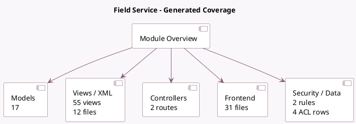

<!-- GENERATED:MODULE -->
---
tags: [odoo, enterprise, module]
---

# Field Service

- Scope: Enterprise Addons
- Source: enterprise/industry_fsm
- Dependencies: [[docs/Enterprise Addons/project_enterprise/project_enterprise|project_enterprise]], [[docs/Enterprise Addons/timesheet_grid/timesheet_grid|timesheet_grid]], [[docs/Community Addons/base_geolocalize/base_geolocalize|base_geolocalize]]

## Summary

Schedule and track onsite operations, time and material

## Generated coverage

- Models: 17
- XML files with UI/data artifacts: 12
- Views: 55
- Actions: 150
- Menus: 21
- Rules (ir.rule): 2
- Access CSV entries: 4
- Controller units: 1
- Frontend asset files: 31

## Module map

## Detail notes

- Models: [[docs/Enterprise Addons/industry_fsm/Models|Models]] (17)
- Views and XML: [[docs/Enterprise Addons/industry_fsm/Views|Views]] (12 files)
- Controllers: [[docs/Enterprise Addons/industry_fsm/Controllers|Controllers]] (1)
- Frontend: [[docs/Enterprise Addons/industry_fsm/Frontend|Frontend]] (31 files)

## Key models

- `account.analytic.line`
- `base.document.layout`
- `hr.timesheet.stop.timer.confirmation.wizard`
- `ir.actions.report`
- `ir.ui.menu`
- `project.project`
- `project.task`
- `project.task.recurrence`
- `project.task.stop.timers.wizard`
- `project.task.stop.timers.wizard.line`
- `project.task.type`
- `rating.rating`

## Navigation

- [[../Enterprise Addons/Enterprise Addons|Back to scope]]
- [[../../docs/docs|Back to docs]]

<!-- GENERATED:MODULE -->

