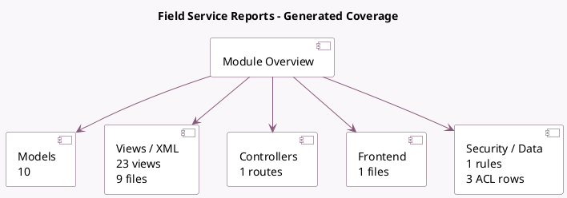

<!-- GENERATED:MODULE -->
---
tags: [odoo, enterprise, module]
---

# Field Service Reports

- Scope: Enterprise Addons
- Source: enterprise/industry_fsm_report
- Dependencies: [[docs/Enterprise Addons/worksheet/worksheet|worksheet]], [[docs/Enterprise Addons/industry_fsm/industry_fsm|industry_fsm]], [[docs/Enterprise Addons/web_studio/web_studio|web_studio]]

## Summary

Create Reports for Field service technicians

## Generated coverage

- Models: 10
- XML files with UI/data artifacts: 9
- Views: 23
- Actions: 25
- Menus: 2
- Rules (ir.rule): 1
- Access CSV entries: 3
- Controller units: 1
- Frontend asset files: 1

## Module map

## Detail notes

- Models: [[docs/Enterprise Addons/industry_fsm_report/Models|Models]] (10)
- Views and XML: [[docs/Enterprise Addons/industry_fsm_report/Views|Views]] (9 files)
- Controllers: [[docs/Enterprise Addons/industry_fsm_report/Controllers|Controllers]] (1)
- Frontend: [[docs/Enterprise Addons/industry_fsm_report/Frontend|Frontend]] (1 files)

## Key models

- `base.document.layout`
- `ir.model`
- `project.project`
- `project.task`
- `project.task.burndown.chart.report`
- `project.task.recurrence`
- `report.industry_fsm.worksheet_custom`
- `report.project.task.user`
- `worksheet.template`
- `worksheet.template.load.wizard`

## Navigation

- [[../Enterprise Addons/Enterprise Addons|Back to scope]]
- [[../../docs/docs|Back to docs]]

<!-- GENERATED:MODULE -->

