<!-- GENERATED:MODEL -->
---
tags: [odoo, enterprise, generated, model]
---

# project.project

- Module: [[docs/Enterprise Addons/industry_fsm_sale/industry_fsm_sale|industry_fsm_sale]]
- Scope: Enterprise Addons
- Defined in module: extension only
- Source files: `models/project_project.py`
- Python classes: `ProjectProject`

## Field footprint

- Detected fields: 5
- Field types: `Boolean` x 4, `Many2one` x 1
- Relation fields: 1

## Sample fields

- `allow_billable`: `Boolean` (compute `_compute_allow_billable`, store `True`)
- `allow_material`: `Boolean` (comodel `Products on Tasks`, compute `_compute_allow_material`, store `True`)
- `allow_quotations`: `Boolean` (comodel `Extra Quotations`, compute `_compute_allow_quotations`, store `True`)
- `hide_price`: `Boolean` (comodel `Hide price on customer report and portal`, compute `_compute_hide_price`, store `True`)
- `sale_line_id`: `Many2one` (compute `_compute_sale_line_id`, store `True`)

## Method hints

- Detected methods: 23
- Action methods: `action_view_sols`, `action_view_sos`
- Compute methods: `_compute_allow_billable`, `_compute_allow_material`, `_compute_allow_quotations`, `_compute_display_sales_stat_buttons`, `_compute_hide_price`, `_compute_partner_id`, `_compute_pricing_type`, `_compute_sale_line_id`
- Onchange methods: none

## Direct relation diagram

```plantuml
@startuml
!define ODOO_COLOR_PRIMARY #714B67
!define ODOO_COLOR_ACCENT #875A7B
!define ODOO_COLOR_BG #FAF7FA

skinparam backgroundColor ODOO_COLOR_BG
skinparam defaultTextAlignment left
skinparam ArrowColor ODOO_COLOR_ACCENT
skinparam ClassBackgroundColor white
skinparam ClassBorderColor ODOO_COLOR_PRIMARY
skinparam ComponentBackgroundColor white
skinparam ComponentBorderColor ODOO_COLOR_PRIMARY
skinparam NoteBackgroundColor #FFF8FF
skinparam NoteBorderColor ODOO_COLOR_ACCENT
skinparam SequenceLifeLineBorderColor ODOO_COLOR_ACCENT
skinparam SequenceLifeLineBackgroundColor #FFFFFF
skinparam SequenceParticipantBorderColor ODOO_COLOR_PRIMARY
skinparam SequenceParticipantBackgroundColor #FFFFFF
skinparam sequence {
  ArrowColor ODOO_COLOR_ACCENT
  ActorBorderColor ODOO_COLOR_PRIMARY
}
title project.project - Direct Relations
class "project.project" as project_project
@enduml
```

## Navigation

- **Parent:** [[docs/Enterprise Addons/industry_fsm_sale/Models]]

<!-- GENERATED:MODEL -->
