<!-- GENERATED:MODEL -->
---
tags: [odoo, enterprise, generated, model]
---

# project.sale.line.employee.map

- Module: [[docs/Enterprise Addons/industry_fsm_sale/industry_fsm_sale|industry_fsm_sale]]
- Scope: Enterprise Addons
- Defined in module: extension only
- Source files: `models/project_sale_line_employee_map.py`
- Python classes: `ProjectSaleLineEmployeeMap`

## Field footprint

- Detected fields: 2
- Field types: `Float` x 1, `Many2one` x 1
- Relation fields: 1

## Sample fields

- `price_unit`: `Float`
- `timesheet_product_id`: `Many2one` (comodel `product.product`)

## Method hints

- Detected methods: 3
- Action methods: none
- Compute methods: `_compute_currency_id`, `_compute_price_unit`, `_compute_sale_line_id`
- Onchange methods: none

## Direct relation diagram

```plantuml
@startuml
!define ODOO_COLOR_PRIMARY #714B67
!define ODOO_COLOR_ACCENT #875A7B
!define ODOO_COLOR_BG #FAF7FA

skinparam backgroundColor ODOO_COLOR_BG
skinparam defaultTextAlignment left
skinparam ArrowColor ODOO_COLOR_ACCENT
skinparam ClassBackgroundColor white
skinparam ClassBorderColor ODOO_COLOR_PRIMARY
skinparam ComponentBackgroundColor white
skinparam ComponentBorderColor ODOO_COLOR_PRIMARY
skinparam NoteBackgroundColor #FFF8FF
skinparam NoteBorderColor ODOO_COLOR_ACCENT
skinparam SequenceLifeLineBorderColor ODOO_COLOR_ACCENT
skinparam SequenceLifeLineBackgroundColor #FFFFFF
skinparam SequenceParticipantBorderColor ODOO_COLOR_PRIMARY
skinparam SequenceParticipantBackgroundColor #FFFFFF
skinparam sequence {
  ArrowColor ODOO_COLOR_ACCENT
  ActorBorderColor ODOO_COLOR_PRIMARY
}
title project.sale.line.employee.map - Direct Relations
class "project.sale.line.employee.map" as project_sale_line_employee_map
class "product.product" as product_product
project_sale_line_employee_map --> product_product : timesheet_product_id
@enduml
```

## Navigation

- **Parent:** [[docs/Enterprise Addons/industry_fsm_sale/Models]]

<!-- GENERATED:MODEL -->
