<!-- GENERATED:MODEL -->
---
tags: [odoo, enterprise, generated, model]
---

# project.task

- Module: [[docs/Enterprise Addons/industry_fsm_sale/industry_fsm_sale|industry_fsm_sale]]
- Scope: Enterprise Addons
- Defined in module: extension only
- Source files: `models/project_task.py`
- Python classes: `ProjectTask`

## Field footprint

- Detected fields: 15
- Field types: `Boolean` x 5, `Char` x 1, `Float` x 1, `Integer` x 5, `Many2one` x 2, `Selection` x 1
- Relation fields: 2

## Sample fields

- `allow_material`: `Boolean` (related `project_id.allow_material`)
- `allow_quotations`: `Boolean` (related `project_id.allow_quotations`)
- `currency_id`: `Many2one` (comodel `res.currency`, compute `_compute_currency_id`)
- `display_create_invoice_primary`: `Boolean` (compute `_compute_display_create_invoice_buttons`)
- `display_create_invoice_secondary`: `Boolean` (compute `_compute_display_create_invoice_buttons`)
- `invoice_count`: `Integer` (comodel `Number of invoices`, related `sale_order_id.invoice_count`)
- `invoice_status`: `Selection` (related `sale_order_id.invoice_status`)
- `material_line_product_count`: `Integer` (compute `_compute_material_line_totals`)
- `material_line_total_price`: `Float` (compute `_compute_material_line_totals`)
- `portal_invoice_count`: `Integer` (comodel `Invoice Count`, compute `_compute_portal_invoice_count`)
- `portal_quotation_count`: `Integer` (compute `_compute_portal_quotation_count`)
- `pricelist_id`: `Many2one` (comodel `product.pricelist`, compute `_compute_pricelist_id`)
- `quotation_count`: `Integer` (compute `_compute_quotation_count`)
- `under_warranty`: `Boolean` (comodel `Under Warranty`)
- `warning_message`: `Char` (comodel `Warning Message`, compute `_compute_warning_message`)

## Method hints

- Detected methods: 36
- Action methods: `action_create_invoice`, `action_fsm_create_quotation`, `action_fsm_validate`, `action_fsm_view_material`, `action_fsm_view_quotations`, `action_project_sharing_view_invoices`, `action_project_sharing_view_quotations`, `action_view_invoices`
- Compute methods: `_compute_currency_id`, `_compute_display_conditions_count`, `_compute_display_create_invoice_buttons`, `_compute_display_send_report_buttons`, `_compute_display_sign_report_buttons`, `_compute_material_line_totals`, `_compute_partner_id`, `_compute_portal_invoice_count`, and 5 more
- Onchange methods: none

## Direct relation diagram

```plantuml
@startuml
!define ODOO_COLOR_PRIMARY #714B67
!define ODOO_COLOR_ACCENT #875A7B
!define ODOO_COLOR_BG #FAF7FA

skinparam backgroundColor ODOO_COLOR_BG
skinparam defaultTextAlignment left
skinparam ArrowColor ODOO_COLOR_ACCENT
skinparam ClassBackgroundColor white
skinparam ClassBorderColor ODOO_COLOR_PRIMARY
skinparam ComponentBackgroundColor white
skinparam ComponentBorderColor ODOO_COLOR_PRIMARY
skinparam NoteBackgroundColor #FFF8FF
skinparam NoteBorderColor ODOO_COLOR_ACCENT
skinparam SequenceLifeLineBorderColor ODOO_COLOR_ACCENT
skinparam SequenceLifeLineBackgroundColor #FFFFFF
skinparam SequenceParticipantBorderColor ODOO_COLOR_PRIMARY
skinparam SequenceParticipantBackgroundColor #FFFFFF
skinparam sequence {
  ArrowColor ODOO_COLOR_ACCENT
  ActorBorderColor ODOO_COLOR_PRIMARY
}
title project.task - Direct Relations
class "project.task" as project_task
class "product.pricelist" as product_pricelist
class "res.currency" as res_currency
project_task --> res_currency : currency_id
project_task --> product_pricelist : pricelist_id
@enduml
```

## Navigation

- **Parent:** [[docs/Enterprise Addons/industry_fsm_sale/Models]]

<!-- GENERATED:MODEL -->
