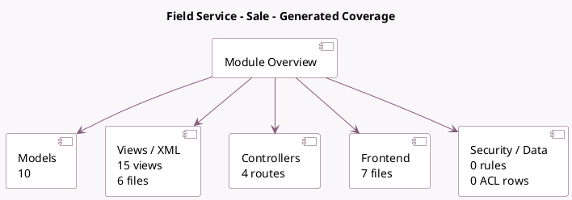

<!-- GENERATED:MODULE -->
---
tags: [odoo, enterprise, module]
---

# Field Service - Sale

- Scope: Enterprise Addons
- Source: enterprise/industry_fsm_sale
- Dependencies: [[docs/Enterprise Addons/industry_fsm/industry_fsm|industry_fsm]], [[docs/Enterprise Addons/sale_timesheet_enterprise/sale_timesheet_enterprise|sale_timesheet_enterprise]]

## Summary

Schedule and track onsite operations, invoice time and material

## Generated coverage

- Models: 10
- XML files with UI/data artifacts: 6
- Views: 15
- Actions: 21
- Menus: 2
- Rules (ir.rule): 0
- Access CSV entries: 0
- Controller units: 2
- Frontend asset files: 7

## Module map

## Detail notes

- Models: [[docs/Enterprise Addons/industry_fsm_sale/Models|Models]] (10)
- Views and XML: [[docs/Enterprise Addons/industry_fsm_sale/Views|Views]] (6 files)
- Controllers: [[docs/Enterprise Addons/industry_fsm_sale/Controllers|Controllers]] (2)
- Frontend: [[docs/Enterprise Addons/industry_fsm_sale/Frontend|Frontend]] (7 files)

## Key models

- `account.analytic.line`
- `product.product`
- `product.template`
- `project.project`
- `project.sale.line.employee.map`
- `project.task`
- `report.project.task.user.fsm`
- `sale.advance.payment.inv`
- `sale.order`
- `sale.order.line`

## Navigation

- [[../Enterprise Addons/Enterprise Addons|Back to scope]]
- [[../../docs/docs|Back to docs]]

<!-- GENERATED:MODULE -->

