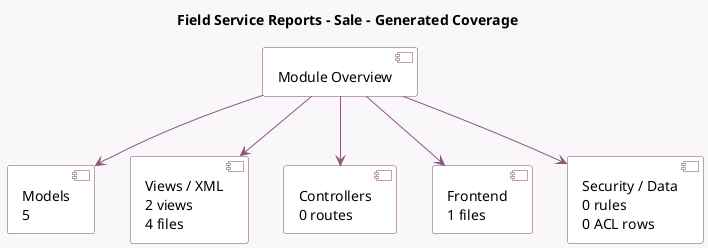

<!-- GENERATED:MODULE -->
---
tags: [odoo, enterprise, module]
---

# Field Service Reports - Sale

- Scope: Enterprise Addons
- Source: enterprise/industry_fsm_sale_report
- Dependencies: [[docs/Enterprise Addons/industry_fsm_sale/industry_fsm_sale|industry_fsm_sale]], [[docs/Enterprise Addons/industry_fsm_report/industry_fsm_report|industry_fsm_report]]

## Summary

Create Reports for Field service technicians

## Generated coverage

- Models: 5
- XML files with UI/data artifacts: 4
- Views: 2
- Actions: 2
- Menus: 0
- Rules (ir.rule): 0
- Access CSV entries: 0
- Controller units: 0
- Frontend asset files: 1

## Module map

## Detail notes

- Models: [[docs/Enterprise Addons/industry_fsm_sale_report/Models|Models]] (5)
- Views and XML: [[docs/Enterprise Addons/industry_fsm_sale_report/Views|Views]] (4 files)
- Frontend: [[docs/Enterprise Addons/industry_fsm_sale_report/Frontend|Frontend]] (1 files)

## Key models

- `product.product`
- `product.template`
- `project.project`
- `project.task`
- `sale.order.line`

## Navigation

- [[../Enterprise Addons/Enterprise Addons|Back to scope]]
- [[../../docs/docs|Back to docs]]

<!-- GENERATED:MODULE -->

