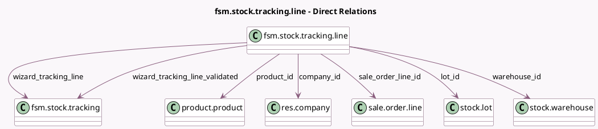

<!-- GENERATED:MODEL -->
---
tags: [odoo, enterprise, generated, model]
---

# fsm.stock.tracking.line

- Module: [[docs/Enterprise Addons/industry_fsm_stock/industry_fsm_stock|industry_fsm_stock]]
- Scope: Enterprise Addons
- Defined in module: yes
- Source files: `wizard/fsm_stock_tracking.py`
- Python classes: `FsmStockTrackingLine`
- Description: Lines for FSM Stock Tracking

## Field footprint

- Detected fields: 9
- Field types: `Boolean` x 1, `Float` x 1, `Many2one` x 7
- Relation fields: 7

## Sample fields

- `company_id`: `Many2one` (comodel `res.company`)
- `is_same_warehouse`: `Boolean` (compute `_compute_warehouse`)
- `lot_id`: `Many2one` (comodel `stock.lot`)
- `product_id`: `Many2one` (comodel `product.product`)
- `quantity`: `Float`
- `sale_order_line_id`: `Many2one` (comodel `sale.order.line`)
- `warehouse_id`: `Many2one` (comodel `stock.warehouse`, compute `_compute_warehouse`)
- `wizard_tracking_line`: `Many2one` (comodel `fsm.stock.tracking`)
- `wizard_tracking_line_validated`: `Many2one` (comodel `fsm.stock.tracking`)

## Method hints

- Detected methods: 2
- Action methods: none
- Compute methods: `_compute_warehouse`
- Onchange methods: none

## Direct relation diagram

## Navigation

- **Parent:** [[docs/Enterprise Addons/industry_fsm_stock/Models]]

<!-- GENERATED:MODEL -->
