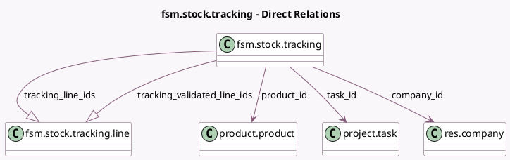

<!-- GENERATED:MODEL -->
---
tags: [odoo, enterprise, generated, model]
---

# fsm.stock.tracking

- Module: [[docs/Enterprise Addons/industry_fsm_stock/industry_fsm_stock|industry_fsm_stock]]
- Scope: Enterprise Addons
- Defined in module: yes
- Source files: `wizard/fsm_stock_tracking.py`
- Python classes: `FsmStockTracking`
- Description: Track Stock

## Field footprint

- Detected fields: 7
- Field types: `Boolean` x 1, `Many2one` x 3, `One2many` x 2, `Selection` x 1
- Relation fields: 5

## Sample fields

- `company_id`: `Many2one` (comodel `res.company`)
- `is_same_warehouse`: `Boolean` (compute `_compute_is_same_warehouse`)
- `product_id`: `Many2one` (comodel `product.product`)
- `task_id`: `Many2one` (comodel `project.task`)
- `tracking`: `Selection` (related `product_id.tracking`)
- `tracking_line_ids`: `One2many` (comodel `fsm.stock.tracking.line`)
- `tracking_validated_line_ids`: `One2many` (comodel `fsm.stock.tracking.line`)

## Method hints

- Detected methods: 7
- Action methods: none
- Compute methods: `_compute_is_same_warehouse`
- Onchange methods: none

## Direct relation diagram

## Navigation

- **Parent:** [[docs/Enterprise Addons/industry_fsm_stock/Models]]

<!-- GENERATED:MODEL -->
