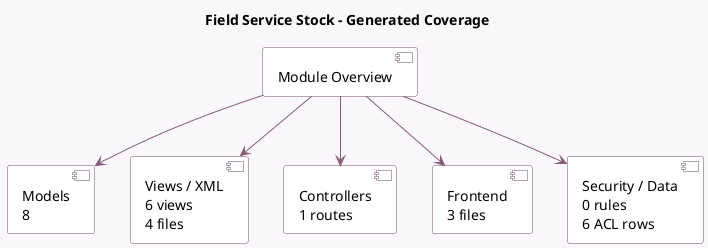

<!-- GENERATED:MODULE -->
---
tags: [odoo, enterprise, module]
---

# Field Service Stock

- Scope: Enterprise Addons
- Source: enterprise/industry_fsm_stock
- Dependencies: [[docs/Enterprise Addons/industry_fsm_sale/industry_fsm_sale|industry_fsm_sale]], [[docs/Community Addons/sale_stock/sale_stock|sale_stock]]

## Summary

Validate stock moves for product added on sales orders through Field Service Management App

## Generated coverage

- Models: 8
- XML files with UI/data artifacts: 4
- Views: 6
- Actions: 0
- Menus: 0
- Rules (ir.rule): 0
- Access CSV entries: 6
- Controller units: 1
- Frontend asset files: 3

## Module map

## Detail notes

- Models: [[docs/Enterprise Addons/industry_fsm_stock/Models|Models]] (8)
- Views and XML: [[docs/Enterprise Addons/industry_fsm_stock/Views|Views]] (4 files)
- Controllers: [[docs/Enterprise Addons/industry_fsm_stock/Controllers|Controllers]] (1)
- Frontend: [[docs/Enterprise Addons/industry_fsm_stock/Frontend|Frontend]] (3 files)

## Key models

- `fsm.stock.tracking`
- `fsm.stock.tracking.line`
- `product.product`
- `project.project`
- `project.task`
- `sale.order`
- `sale.order.line`
- `stock.move`

## Navigation

- [[../Enterprise Addons/Enterprise Addons|Back to scope]]
- [[../../docs/docs|Back to docs]]

<!-- GENERATED:MODULE -->

