<!-- GENERATED:MODEL -->
---
tags: [odoo, enterprise, generated, model]
---

# add.iot.box

- Module: [[docs/Enterprise Addons/iot/iot|iot]]
- Scope: Enterprise Addons
- Defined in module: yes
- Source files: `wizard/add_iot_box.py`
- Python classes: `AddIotBox`
- Description: Add IoT Box wizard

## Field footprint

- Detected fields: 6
- Field types: `Char` x 3, `Many2one` x 1, `One2many` x 1, `Selection` x 1
- Relation fields: 2

## Sample fields

- `discovered_box_ids`: `One2many` (comodel `iot.discovered.box`)
- `iot_box_to_connect`: `Many2one` (comodel `iot.discovered.box`)
- `offline_pairing_token`: `Char` (comodel `Token`, store `False`)
- `pairing_code`: `Char`
- `serial_number`: `Char`
- `stage`: `Selection`

## Method hints

- Detected methods: 10
- Action methods: none
- Compute methods: `_compute_pairing_token`
- Onchange methods: none

## Direct relation diagram

```plantuml
@startuml
!define ODOO_COLOR_PRIMARY #714B67
!define ODOO_COLOR_ACCENT #875A7B
!define ODOO_COLOR_BG #FAF7FA

skinparam backgroundColor ODOO_COLOR_BG
skinparam defaultTextAlignment left
skinparam ArrowColor ODOO_COLOR_ACCENT
skinparam ClassBackgroundColor white
skinparam ClassBorderColor ODOO_COLOR_PRIMARY
skinparam ComponentBackgroundColor white
skinparam ComponentBorderColor ODOO_COLOR_PRIMARY
skinparam NoteBackgroundColor #FFF8FF
skinparam NoteBorderColor ODOO_COLOR_ACCENT
skinparam SequenceLifeLineBorderColor ODOO_COLOR_ACCENT
skinparam SequenceLifeLineBackgroundColor #FFFFFF
skinparam SequenceParticipantBorderColor ODOO_COLOR_PRIMARY
skinparam SequenceParticipantBackgroundColor #FFFFFF
skinparam sequence {
  ArrowColor ODOO_COLOR_ACCENT
  ActorBorderColor ODOO_COLOR_PRIMARY
}
title add.iot.box - Direct Relations
class "add.iot.box" as add_iot_box
class "iot.discovered.box" as iot_discovered_box
add_iot_box --|> iot_discovered_box : discovered_box_ids
add_iot_box --> iot_discovered_box : iot_box_to_connect
@enduml
```

## Navigation

- **Parent:** [[docs/Enterprise Addons/iot/Models]]

<!-- GENERATED:MODEL -->
