<!-- GENERATED:MODEL -->
---
tags: [odoo, enterprise, generated, model]
---

# iot.box

- Module: [[docs/Enterprise Addons/iot/iot|iot]]
- Scope: Enterprise Addons
- Defined in module: yes
- Source files: `models/iot_box.py`
- Python classes: `IotBox`
- Description: IoT Box

## Field footprint

- Detected fields: 12
- Field types: `Boolean` x 2, `Char` x 5, `Datetime` x 1, `Html` x 1, `Integer` x 1, `Many2one` x 1, `One2many` x 1
- Relation fields: 2

## Sample fields

- `company_id`: `Many2one` (comodel `res.company`)
- `device_count`: `Integer` (compute `_compute_device_count`)
- `device_ids`: `One2many` (comodel `iot.device`)
- `drivers_auto_update`: `Boolean` (comodel `Automatic drivers update`)
- `identifier`: `Char`
- `ip`: `Char` (comodel `Domain Address`)
- `must_install_fdm_module`: `Boolean` (comodel `A fiscal data module is connected to this IoT Box`, compute `_compute_must_install_fdm_module`)
- `name`: `Char` (comodel `Name`)
- `ssl_certificate_end_date`: `Datetime` (comodel `SSL Certificate End Date`)
- `token`: `Char`
- `version`: `Char` (comodel `Image Version`)
- `version_commit_url`: `Html` (compute `_compute_commit_url`)

## Method hints

- Detected methods: 8
- Action methods: none
- Compute methods: `_compute_commit_url`, `_compute_device_count`, `_compute_must_install_fdm_module`
- Onchange methods: none

## Direct relation diagram

```plantuml
@startuml
!define ODOO_COLOR_PRIMARY #714B67
!define ODOO_COLOR_ACCENT #875A7B
!define ODOO_COLOR_BG #FAF7FA

skinparam backgroundColor ODOO_COLOR_BG
skinparam defaultTextAlignment left
skinparam ArrowColor ODOO_COLOR_ACCENT
skinparam ClassBackgroundColor white
skinparam ClassBorderColor ODOO_COLOR_PRIMARY
skinparam ComponentBackgroundColor white
skinparam ComponentBorderColor ODOO_COLOR_PRIMARY
skinparam NoteBackgroundColor #FFF8FF
skinparam NoteBorderColor ODOO_COLOR_ACCENT
skinparam SequenceLifeLineBorderColor ODOO_COLOR_ACCENT
skinparam SequenceLifeLineBackgroundColor #FFFFFF
skinparam SequenceParticipantBorderColor ODOO_COLOR_PRIMARY
skinparam SequenceParticipantBackgroundColor #FFFFFF
skinparam sequence {
  ArrowColor ODOO_COLOR_ACCENT
  ActorBorderColor ODOO_COLOR_PRIMARY
}
title iot.box - Direct Relations
class "iot.box" as iot_box
class "iot.device" as iot_device
class "res.company" as res_company
iot_box --|> iot_device : device_ids
iot_box --> res_company : company_id
@enduml
```

## Navigation

- **Parent:** [[docs/Enterprise Addons/iot/Models]]

<!-- GENERATED:MODEL -->
