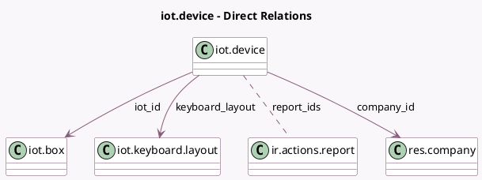

<!-- GENERATED:MODEL -->
---
tags: [odoo, enterprise, generated, model]
---

# iot.device

- Module: [[docs/Enterprise Addons/iot/iot|iot]]
- Scope: Enterprise Addons
- Defined in module: yes
- Source files: `models/iot_device.py`
- Python classes: `IotDevice`
- Description: IOT Device

## Field footprint

- Detected fields: 15
- Field types: `Boolean` x 2, `Char` x 5, `Many2many` x 1, `Many2one` x 3, `Selection` x 4
- Relation fields: 4

## Sample fields

- `company_id`: `Many2one` (comodel `res.company`, related `iot_id.company_id`)
- `connected_status`: `Selection`
- `connection`: `Selection`
- `display_url`: `Char` (comodel `Display URL`)
- `identifier`: `Char`
- `iot_id`: `Many2one` (comodel `iot.box`)
- `iot_ip`: `Char` (related `iot_id.ip`)
- `is_scanner`: `Boolean` (compute `_compute_is_scanner`)
- `keyboard_layout`: `Many2one` (comodel `iot.keyboard.layout`)
- `manual_measurement`: `Boolean` (comodel `Manual Measurement`, compute `_compute_manual_measurement`)
- `manufacturer`: `Char`
- `name`: `Char` (comodel `Name`)
- `report_ids`: `Many2many` (comodel `ir.actions.report`)
- `subtype`: `Selection`
- `type`: `Selection`

## Method hints

- Detected methods: 4
- Action methods: none
- Compute methods: `_compute_display_name`, `_compute_is_scanner`, `_compute_manual_measurement`
- Onchange methods: none

## Direct relation diagram

## Navigation

- **Parent:** [[docs/Enterprise Addons/iot/Models]]

<!-- GENERATED:MODEL -->
