<!-- GENERATED:MODEL -->
---
tags: [odoo, enterprise, generated, model]
---

# iot.discovered.box

- Module: [[docs/Enterprise Addons/iot/iot|iot]]
- Scope: Enterprise Addons
- Defined in module: yes
- Source files: `wizard/discovered_iot_box.py`
- Python classes: `DiscoveredIotBox`
- Description: An IoT box that is in pairing mode

## Field footprint

- Detected fields: 4
- Field types: `Char` x 3, `Many2one` x 1
- Relation fields: 1

## Sample fields

- `add_iot_box_wizard_id`: `Many2one` (comodel `add.iot.box`)
- `name`: `Char` (compute `_compute_box_name`)
- `pairing_code`: `Char`
- `serial_number`: `Char`

## Method hints

- Detected methods: 1
- Action methods: none
- Compute methods: `_compute_box_name`
- Onchange methods: none

## Direct relation diagram

```plantuml
@startuml
!define ODOO_COLOR_PRIMARY #714B67
!define ODOO_COLOR_ACCENT #875A7B
!define ODOO_COLOR_BG #FAF7FA

skinparam backgroundColor ODOO_COLOR_BG
skinparam defaultTextAlignment left
skinparam ArrowColor ODOO_COLOR_ACCENT
skinparam ClassBackgroundColor white
skinparam ClassBorderColor ODOO_COLOR_PRIMARY
skinparam ComponentBackgroundColor white
skinparam ComponentBorderColor ODOO_COLOR_PRIMARY
skinparam NoteBackgroundColor #FFF8FF
skinparam NoteBorderColor ODOO_COLOR_ACCENT
skinparam SequenceLifeLineBorderColor ODOO_COLOR_ACCENT
skinparam SequenceLifeLineBackgroundColor #FFFFFF
skinparam SequenceParticipantBorderColor ODOO_COLOR_PRIMARY
skinparam SequenceParticipantBackgroundColor #FFFFFF
skinparam sequence {
  ArrowColor ODOO_COLOR_ACCENT
  ActorBorderColor ODOO_COLOR_PRIMARY
}
title iot.discovered.box - Direct Relations
class "iot.discovered.box" as iot_discovered_box
class "add.iot.box" as add_iot_box
iot_discovered_box --> add_iot_box : add_iot_box_wizard_id
@enduml
```

## Navigation

- **Parent:** [[docs/Enterprise Addons/iot/Models]]

<!-- GENERATED:MODEL -->
