<!-- GENERATED:MODEL -->
---
tags: [odoo, enterprise, generated, model]
---

# knowledge.article

- Module: [[docs/Enterprise Addons/knowledge/knowledge|knowledge]]
- Scope: Enterprise Addons
- Defined in module: yes
- Source files: `models/knowledge_article.py`
- Python classes: `KnowledgeArticle`
- Description: Knowledge Article
- Inherits: `html.field.history.mixin`, `mail.activity.mixin`, `mail.thread`

## Field footprint

- Detected fields: 56
- Field types: `Boolean` x 20, `Char` x 7, `Date` x 1, `Datetime` x 1, `Float` x 1, `Html` x 2, `Image` x 1, `Integer` x 5, `Many2one` x 8, `One2many` x 3, `Properties` x 1, `PropertiesDefinition` x 1, `Selection` x 4, `Text` x 1
- Relation fields: 11

## Sample fields

- `active`: `Boolean`
- `article_member_ids`: `One2many` (comodel `knowledge.article.member`)
- `article_properties`: `Properties` (comodel `Properties`)
- `article_properties_definition`: `PropertiesDefinition` (comodel `Article Item Properties`)
- `article_url`: `Char` (comodel `Article URL`, compute `_compute_article_url`)
- `body`: `Html`
- `category`: `Selection` (compute `_compute_category`, store `True`)
- `child_ids`: `One2many` (comodel `knowledge.article`)
- `cover_image_id`: `Many2one` (comodel `knowledge.cover`)
- `cover_image_position`: `Float`
- `cover_image_url`: `Char` (related `cover_image_id.attachment_url`)
- `deletion_date`: `Date` (compute `_compute_deletion_date`)
- `favorite_count`: `Integer` (compute `_compute_favorite_count`, store `True`)
- `favorite_ids`: `One2many` (comodel `knowledge.article.favorite`)
- `full_width`: `Boolean`
- `has_article_children`: `Boolean` (comodel `Has normal article children?`, compute `_compute_has_article_children`)
- `has_item_children`: `Boolean` (comodel `Has article item children?`, compute `_compute_has_article_children`)
- `has_item_parent`: `Boolean` (comodel `Is the parent an Item?`, related `parent_id.is_article_item`)
- `icon`: `Char`
- `inherited_permission`: `Selection` (compute `_compute_inherited_permission`, store `True`)

## Method hints

- Detected methods: 106
- Action methods: `action_archive`, `action_home_page`, `action_join`, `action_make_copy`, `action_make_private_copy`, `action_redirect_to_parent`, `action_send_to_trash`, `action_set_lock`, and 2 more
- Compute methods: `_compute_article_url`, `_compute_category`, `_compute_deletion_date`, `_compute_display_name`, `_compute_favorite_count`, `_compute_has_article_children`, `_compute_inherited_permission`, `_compute_is_article_visible`, and 12 more
- Onchange methods: none

## Direct relation diagram

```plantuml
@startuml
!define ODOO_COLOR_PRIMARY #714B67
!define ODOO_COLOR_ACCENT #875A7B
!define ODOO_COLOR_BG #FAF7FA

skinparam backgroundColor ODOO_COLOR_BG
skinparam defaultTextAlignment left
skinparam ArrowColor ODOO_COLOR_ACCENT
skinparam ClassBackgroundColor white
skinparam ClassBorderColor ODOO_COLOR_PRIMARY
skinparam ComponentBackgroundColor white
skinparam ComponentBorderColor ODOO_COLOR_PRIMARY
skinparam NoteBackgroundColor #FFF8FF
skinparam NoteBorderColor ODOO_COLOR_ACCENT
skinparam SequenceLifeLineBorderColor ODOO_COLOR_ACCENT
skinparam SequenceLifeLineBackgroundColor #FFFFFF
skinparam SequenceParticipantBorderColor ODOO_COLOR_PRIMARY
skinparam SequenceParticipantBackgroundColor #FFFFFF
skinparam sequence {
  ArrowColor ODOO_COLOR_ACCENT
  ActorBorderColor ODOO_COLOR_PRIMARY
}
title knowledge.article - Direct Relations
class "knowledge.article" as knowledge_article
class "knowledge.article" as knowledge_article
class "knowledge.article.favorite" as knowledge_article_favorite
class "knowledge.article.member" as knowledge_article_member
class "knowledge.article.stage" as knowledge_article_stage
class "knowledge.article.template.category" as knowledge_article_template_category
class "knowledge.cover" as knowledge_cover
class "res.users" as res_users
knowledge_article --> knowledge_cover : cover_image_id
knowledge_article --> knowledge_article : inherited_permission_parent_id
knowledge_article --|> knowledge_article_member : article_member_ids
knowledge_article --> knowledge_article : parent_id
knowledge_article --|> knowledge_article : child_ids
knowledge_article --> knowledge_article : root_article_id
knowledge_article --> knowledge_article_stage : stage_id
knowledge_article --> res_users : last_edition_uid
knowledge_article --|> knowledge_article_favorite : favorite_ids
knowledge_article --> knowledge_article_template_category : template_category_id
knowledge_article --> knowledge_article : origin_template_id
@enduml
```

## Navigation

- **Parent:** [[docs/Enterprise Addons/knowledge/Models]]

<!-- GENERATED:MODEL -->
