<!-- GENERATED:MODEL -->
---
tags: [odoo, enterprise, generated, model]
---

# knowledge.article.thread

- Module: [[docs/Enterprise Addons/knowledge/knowledge|knowledge]]
- Scope: Enterprise Addons
- Defined in module: yes
- Source files: `models/knowledge_article_thread.py`
- Python classes: `KnowledgeArticleThread`
- Description: Article Discussion Thread
- Inherits: `mail.thread`

## Field footprint

- Detected fields: 3
- Field types: `Boolean` x 1, `Many2one` x 1, `Text` x 1
- Relation fields: 1

## Sample fields

- `article_anchor_text`: `Text` (comodel `Anchor Text`)
- `article_id`: `Many2one` (comodel `knowledge.article`)
- `is_resolved`: `Boolean` (comodel `Thread Closed`)

## Method hints

- Detected methods: 10
- Action methods: none
- Compute methods: `_compute_display_name`
- Onchange methods: none

## Direct relation diagram

```plantuml
@startuml
!define ODOO_COLOR_PRIMARY #714B67
!define ODOO_COLOR_ACCENT #875A7B
!define ODOO_COLOR_BG #FAF7FA

skinparam backgroundColor ODOO_COLOR_BG
skinparam defaultTextAlignment left
skinparam ArrowColor ODOO_COLOR_ACCENT
skinparam ClassBackgroundColor white
skinparam ClassBorderColor ODOO_COLOR_PRIMARY
skinparam ComponentBackgroundColor white
skinparam ComponentBorderColor ODOO_COLOR_PRIMARY
skinparam NoteBackgroundColor #FFF8FF
skinparam NoteBorderColor ODOO_COLOR_ACCENT
skinparam SequenceLifeLineBorderColor ODOO_COLOR_ACCENT
skinparam SequenceLifeLineBackgroundColor #FFFFFF
skinparam SequenceParticipantBorderColor ODOO_COLOR_PRIMARY
skinparam SequenceParticipantBackgroundColor #FFFFFF
skinparam sequence {
  ArrowColor ODOO_COLOR_ACCENT
  ActorBorderColor ODOO_COLOR_PRIMARY
}
title knowledge.article.thread - Direct Relations
class "knowledge.article.thread" as knowledge_article_thread
class "knowledge.article" as knowledge_article
knowledge_article_thread --> knowledge_article : article_id
@enduml
```

## Navigation

- **Parent:** [[docs/Enterprise Addons/knowledge/Models]]

<!-- GENERATED:MODEL -->
