<!-- GENERATED:MODEL -->
---
tags: [odoo, enterprise, generated, model]
---

# knowledge.cover

- Module: [[docs/Enterprise Addons/knowledge/knowledge|knowledge]]
- Scope: Enterprise Addons
- Defined in module: yes
- Source files: `models/knowledge_cover.py`
- Python classes: `KnowledgeCover`
- Description: Knowledge Cover

## Field footprint

- Detected fields: 3
- Field types: `Char` x 1, `Many2one` x 1, `One2many` x 1
- Relation fields: 2

## Sample fields

- `article_ids`: `One2many` (comodel `knowledge.article`)
- `attachment_id`: `Many2one` (comodel `ir.attachment`)
- `attachment_url`: `Char` (comodel `Cover URL`, compute `_compute_attachment_url`, store `True`)

## Method hints

- Detected methods: 3
- Action methods: none
- Compute methods: `_compute_attachment_url`
- Onchange methods: none

## Direct relation diagram

```plantuml
@startuml
!define ODOO_COLOR_PRIMARY #714B67
!define ODOO_COLOR_ACCENT #875A7B
!define ODOO_COLOR_BG #FAF7FA

skinparam backgroundColor ODOO_COLOR_BG
skinparam defaultTextAlignment left
skinparam ArrowColor ODOO_COLOR_ACCENT
skinparam ClassBackgroundColor white
skinparam ClassBorderColor ODOO_COLOR_PRIMARY
skinparam ComponentBackgroundColor white
skinparam ComponentBorderColor ODOO_COLOR_PRIMARY
skinparam NoteBackgroundColor #FFF8FF
skinparam NoteBorderColor ODOO_COLOR_ACCENT
skinparam SequenceLifeLineBorderColor ODOO_COLOR_ACCENT
skinparam SequenceLifeLineBackgroundColor #FFFFFF
skinparam SequenceParticipantBorderColor ODOO_COLOR_PRIMARY
skinparam SequenceParticipantBackgroundColor #FFFFFF
skinparam sequence {
  ArrowColor ODOO_COLOR_ACCENT
  ActorBorderColor ODOO_COLOR_PRIMARY
}
title knowledge.cover - Direct Relations
class "knowledge.cover" as knowledge_cover
class "ir.attachment" as ir_attachment
class "knowledge.article" as knowledge_article
knowledge_cover --> ir_attachment : attachment_id
knowledge_cover --|> knowledge_article : article_ids
@enduml
```

## Navigation

- **Parent:** [[docs/Enterprise Addons/knowledge/Models]]

<!-- GENERATED:MODEL -->
