<!-- GENERATED:MODEL -->
---
tags: [odoo, enterprise, generated, model]
---

# knowledge.invite

- Module: [[docs/Enterprise Addons/knowledge/knowledge|knowledge]]
- Scope: Enterprise Addons
- Defined in module: yes
- Source files: `wizard/knowledge_invite.py`
- Python classes: `KnowledgeInvite`
- Description: Knowledge Invite Wizard

## Field footprint

- Detected fields: 5
- Field types: `Boolean` x 1, `Html` x 1, `Many2many` x 1, `Many2one` x 1, `Selection` x 1
- Relation fields: 2

## Sample fields

- `article_id`: `Many2one` (comodel `knowledge.article`)
- `have_share_partners`: `Boolean` (compute `_compute_have_share_partners`)
- `message`: `Html`
- `partner_ids`: `Many2many` (comodel `res.partner`)
- `permission`: `Selection`

## Method hints

- Detected methods: 2
- Action methods: `action_invite_members`
- Compute methods: `_compute_have_share_partners`
- Onchange methods: none

## Direct relation diagram

```plantuml
@startuml
!define ODOO_COLOR_PRIMARY #714B67
!define ODOO_COLOR_ACCENT #875A7B
!define ODOO_COLOR_BG #FAF7FA

skinparam backgroundColor ODOO_COLOR_BG
skinparam defaultTextAlignment left
skinparam ArrowColor ODOO_COLOR_ACCENT
skinparam ClassBackgroundColor white
skinparam ClassBorderColor ODOO_COLOR_PRIMARY
skinparam ComponentBackgroundColor white
skinparam ComponentBorderColor ODOO_COLOR_PRIMARY
skinparam NoteBackgroundColor #FFF8FF
skinparam NoteBorderColor ODOO_COLOR_ACCENT
skinparam SequenceLifeLineBorderColor ODOO_COLOR_ACCENT
skinparam SequenceLifeLineBackgroundColor #FFFFFF
skinparam SequenceParticipantBorderColor ODOO_COLOR_PRIMARY
skinparam SequenceParticipantBackgroundColor #FFFFFF
skinparam sequence {
  ArrowColor ODOO_COLOR_ACCENT
  ActorBorderColor ODOO_COLOR_PRIMARY
}
title knowledge.invite - Direct Relations
class "knowledge.invite" as knowledge_invite
class "knowledge.article" as knowledge_article
class "res.partner" as res_partner
knowledge_invite --> knowledge_article : article_id
knowledge_invite .. res_partner : partner_ids
@enduml
```

## Navigation

- **Parent:** [[docs/Enterprise Addons/knowledge/Models]]

<!-- GENERATED:MODEL -->
