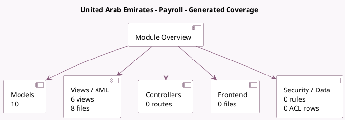

<!-- GENERATED:MODULE -->
---
tags: [odoo, enterprise, module]
---

# United Arab Emirates - Payroll

- Scope: Enterprise Addons
- Source: enterprise/l10n_ae_hr_payroll
- Dependencies: [[docs/Enterprise Addons/hr_payroll/hr_payroll|hr_payroll]], [[docs/Community Addons/hr_work_entry_holidays/hr_work_entry_holidays|hr_work_entry_holidays]]

## Generated coverage

- Models: 10
- XML files with UI/data artifacts: 8
- Views: 6
- Actions: 2
- Menus: 0
- Rules (ir.rule): 0
- Access CSV entries: 0
- Controller units: 0
- Frontend asset files: 0

## Module map

## Detail notes

- Models: [[docs/Enterprise Addons/l10n_ae_hr_payroll/Models|Models]] (10)
- Views and XML: [[docs/Enterprise Addons/l10n_ae_hr_payroll/Views|Views]] (8 files)

## Key models

- `hr.employee`
- `hr.leave.type`
- `hr.payroll.payment.report.wizard`
- `hr.payroll.structure.type`
- `hr.payslip`
- `hr.payslip.run`
- `hr.version`
- `res.bank`
- `res.company`
- `res.config.settings`

## Navigation

- [[../Enterprise Addons/Enterprise Addons|Back to scope]]
- [[../../docs/docs|Back to docs]]

<!-- GENERATED:MODULE -->

