<!-- GENERATED:MODEL -->
---
tags: [odoo, enterprise, generated, model]
---

# l10n_ar.afipws.connection

- Module: [[docs/Enterprise Addons/l10n_ar_edi/l10n_ar_edi|l10n_ar_edi]]
- Scope: Enterprise Addons
- Defined in module: yes
- Source files: `models/l10n_ar_afipws_connection.py`
- Python classes: `L10n_ArAfipwsConnection`
- Description: ARCA Webservice Connection

## Field footprint

- Detected fields: 8
- Field types: `Char` x 1, `Datetime` x 2, `Many2one` x 1, `Selection` x 2, `Text` x 2
- Relation fields: 1

## Sample fields

- `company_id`: `Many2one` (comodel `res.company`)
- `expiration_time`: `Datetime`
- `generation_time`: `Datetime`
- `l10n_ar_afip_ws`: `Selection`
- `sign`: `Text`
- `token`: `Text`
- `type`: `Selection`
- `uniqueid`: `Char` (comodel `Unique ID`)

## Method hints

- Detected methods: 5
- Action methods: none
- Compute methods: none
- Onchange methods: none

## Direct relation diagram

```plantuml
@startuml
!define ODOO_COLOR_PRIMARY #714B67
!define ODOO_COLOR_ACCENT #875A7B
!define ODOO_COLOR_BG #FAF7FA

skinparam backgroundColor ODOO_COLOR_BG
skinparam defaultTextAlignment left
skinparam ArrowColor ODOO_COLOR_ACCENT
skinparam ClassBackgroundColor white
skinparam ClassBorderColor ODOO_COLOR_PRIMARY
skinparam ComponentBackgroundColor white
skinparam ComponentBorderColor ODOO_COLOR_PRIMARY
skinparam NoteBackgroundColor #FFF8FF
skinparam NoteBorderColor ODOO_COLOR_ACCENT
skinparam SequenceLifeLineBorderColor ODOO_COLOR_ACCENT
skinparam SequenceLifeLineBackgroundColor #FFFFFF
skinparam SequenceParticipantBorderColor ODOO_COLOR_PRIMARY
skinparam SequenceParticipantBackgroundColor #FFFFFF
skinparam sequence {
  ArrowColor ODOO_COLOR_ACCENT
  ActorBorderColor ODOO_COLOR_PRIMARY
}
title l10n_ar.afipws.connection - Direct Relations
class "l10n_ar.afipws.connection" as l10n_ar_afipws_connection
class "res.company" as res_company
l10n_ar_afipws_connection --> res_company : company_id
@enduml
```

## Navigation

- **Parent:** [[docs/Enterprise Addons/l10n_ar_edi/Models]]

<!-- GENERATED:MODEL -->
