<!-- GENERATED:MODEL -->
---
tags: [odoo, enterprise, generated, model]
---

# l10n_ar_afip.ws.consult

- Module: [[docs/Enterprise Addons/l10n_ar_edi/l10n_ar_edi|l10n_ar_edi]]
- Scope: Enterprise Addons
- Defined in module: yes
- Source files: `wizards/l10n_ar_afip_ws_consult.py`
- Python classes: `L10n_Ar_AfipWsConsult`
- Description: Consult Invoice Data in ARCA

## Field footprint

- Detected fields: 5
- Field types: `Integer` x 1, `Many2many` x 1, `Many2one` x 2, `Selection` x 1
- Relation fields: 3

## Sample fields

- `available_document_type_ids`: `Many2many` (comodel `l10n_latam.document.type`, compute `_compute_available_document_types`)
- `consult_type`: `Selection`
- `document_type_id`: `Many2one` (comodel `l10n_latam.document.type`)
- `journal_id`: `Many2one` (comodel `account.journal`)
- `number`: `Integer`

## Method hints

- Detected methods: 4
- Action methods: none
- Compute methods: `_compute_available_document_types`
- Onchange methods: `onchange_journal`, `onchange_last_invoice`

## Direct relation diagram

```plantuml
@startuml
!define ODOO_COLOR_PRIMARY #714B67
!define ODOO_COLOR_ACCENT #875A7B
!define ODOO_COLOR_BG #FAF7FA

skinparam backgroundColor ODOO_COLOR_BG
skinparam defaultTextAlignment left
skinparam ArrowColor ODOO_COLOR_ACCENT
skinparam ClassBackgroundColor white
skinparam ClassBorderColor ODOO_COLOR_PRIMARY
skinparam ComponentBackgroundColor white
skinparam ComponentBorderColor ODOO_COLOR_PRIMARY
skinparam NoteBackgroundColor #FFF8FF
skinparam NoteBorderColor ODOO_COLOR_ACCENT
skinparam SequenceLifeLineBorderColor ODOO_COLOR_ACCENT
skinparam SequenceLifeLineBackgroundColor #FFFFFF
skinparam SequenceParticipantBorderColor ODOO_COLOR_PRIMARY
skinparam SequenceParticipantBackgroundColor #FFFFFF
skinparam sequence {
  ArrowColor ODOO_COLOR_ACCENT
  ActorBorderColor ODOO_COLOR_PRIMARY
}
title l10n_ar_afip.ws.consult - Direct Relations
class "l10n_ar_afip.ws.consult" as l10n_ar_afip_ws_consult
class "account.journal" as account_journal
class "l10n_latam.document.type" as l10n_latam_document_type
l10n_ar_afip_ws_consult --> account_journal : journal_id
l10n_ar_afip_ws_consult --> l10n_latam_document_type : document_type_id
l10n_ar_afip_ws_consult .. l10n_latam_document_type : available_document_type_ids
@enduml
```

## Navigation

- **Parent:** [[docs/Enterprise Addons/l10n_ar_edi/Models]]

<!-- GENERATED:MODEL -->
