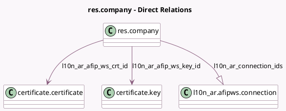

<!-- GENERATED:MODEL -->
---
tags: [odoo, enterprise, generated, model]
---

# res.company

- Module: [[docs/Enterprise Addons/l10n_ar_edi/l10n_ar_edi|l10n_ar_edi]]
- Scope: Enterprise Addons
- Defined in module: extension only
- Source files: `models/res_company.py`
- Python classes: `ResCompany`

## Field footprint

- Detected fields: 8
- Field types: `Boolean` x 1, `Many2one` x 2, `One2many` x 1, `Selection` x 4
- Relation fields: 3

## Sample fields

- `l10n_ar_afip_verification_type`: `Selection`
- `l10n_ar_afip_ws_crt_id`: `Many2one` (comodel `certificate.certificate`, compute `_compute_afip_crt`, store `True`)
- `l10n_ar_afip_ws_environment`: `Selection`
- `l10n_ar_afip_ws_key_id`: `Many2one` (comodel `certificate.key`, compute `_compute_afip_key`, store `True`)
- `l10n_ar_connection_ids`: `One2many` (comodel `l10n_ar.afipws.connection`)
- `l10n_ar_fce_transmission_type`: `Selection`
- `l10n_ar_payment_foreign_currency`: `Selection` (compute `_compute_l10n_ar_payment_foreign_currency`)
- `l10n_ar_show_withholding_legend`: `Boolean`

## Method hints

- Detected methods: 7
- Action methods: none
- Compute methods: `_compute_afip_crt`, `_compute_afip_key`, `_compute_l10n_ar_afip_ws_crt_fname`, `_compute_l10n_ar_payment_foreign_currency`
- Onchange methods: none

## Direct relation diagram

## Navigation

- **Parent:** [[docs/Enterprise Addons/l10n_ar_edi/Models]]

<!-- GENERATED:MODEL -->
