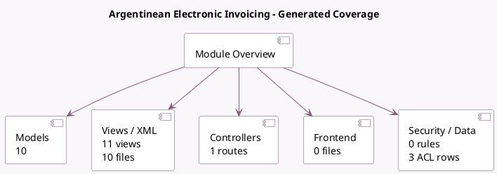

<!-- GENERATED:MODULE -->
---
tags: [odoo, enterprise, module]
---

# Argentinean Electronic Invoicing

- Scope: Enterprise Addons
- Source: enterprise/l10n_ar_edi
- Dependencies: [[docs/Community Addons/l10n_ar/l10n_ar|l10n_ar]], [[docs/Community Addons/certificate/certificate|certificate]]

## Generated coverage

- Models: 10
- XML files with UI/data artifacts: 10
- Views: 11
- Actions: 3
- Menus: 3
- Rules (ir.rule): 0
- Access CSV entries: 3
- Controller units: 1
- Frontend asset files: 0

## Module map

## Detail notes

- Models: [[docs/Enterprise Addons/l10n_ar_edi/Models|Models]] (10)
- Views and XML: [[docs/Enterprise Addons/l10n_ar_edi/Views|Views]] (10 files)
- Controllers: [[docs/Enterprise Addons/l10n_ar_edi/Controllers|Controllers]] (1)

## Key models

- `account.journal`
- `account.move`
- `account.move.reversal`
- `certificate.certificate`
- `l10n_ar.afipws.connection`
- `l10n_ar_afip.ws.consult`
- `product.template`
- `res.company`
- `res.config.settings`
- `res.currency`

## Navigation

- [[../Enterprise Addons/Enterprise Addons|Back to scope]]
- [[../../docs/docs|Back to docs]]

<!-- GENERATED:MODULE -->

