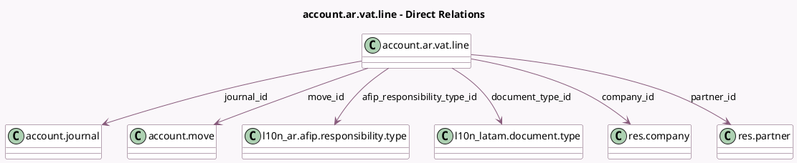

<!-- GENERATED:MODEL -->
---
tags: [odoo, enterprise, generated, model]
---

# account.ar.vat.line

- Module: [[docs/Enterprise Addons/l10n_ar_reports/l10n_ar_reports|l10n_ar_reports]]
- Scope: Enterprise Addons
- Defined in module: yes
- Source files: `report/account_ar_vat_line.py`
- Python classes: `AccountArVatLine`
- Description: VAT line for Analysis in Argentinean Localization

## Field footprint

- Detected fields: 32
- Field types: `Char` x 4, `Date` x 2, `Many2one` x 7, `Monetary` x 17, `Selection` x 2
- Relation fields: 7

## Sample fields

- `afip_responsibility_type_id`: `Many2one` (comodel `l10n_ar.afip.responsibility.type`)
- `afip_responsibility_type_name`: `Char`
- `base_10`: `Monetary`
- `base_21`: `Monetary`
- `base_25`: `Monetary`
- `base_27`: `Monetary`
- `base_5`: `Monetary`
- `city_tax`: `Monetary`
- `company_currency_id`: `Many2one` (related `company_id.currency_id`)
- `company_id`: `Many2one` (comodel `res.company`)
- `cuit`: `Char`
- `date`: `Date`
- `document_type_id`: `Many2one` (comodel `l10n_latam.document.type`)
- `invoice_date`: `Date`
- `journal_id`: `Many2one` (comodel `account.journal`)
- `move_id`: `Many2one` (comodel `account.move`)
- `move_name`: `Char`
- `move_type`: `Selection`
- `not_taxed`: `Monetary`
- `other_taxes`: `Monetary`

## Method hints

- Detected methods: 4
- Action methods: none
- Compute methods: none
- Onchange methods: none

## Direct relation diagram

## Navigation

- **Parent:** [[docs/Enterprise Addons/l10n_ar_reports/Models]]

<!-- GENERATED:MODEL -->
