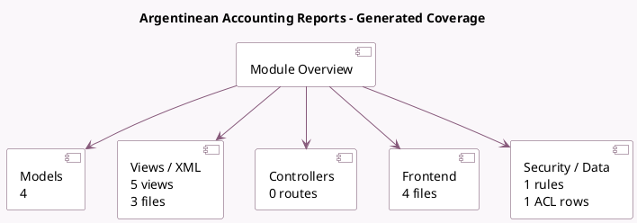

<!-- GENERATED:MODULE -->
---
tags: [odoo, enterprise, module]
---

# Argentinean Accounting Reports

- Scope: Enterprise Addons
- Source: enterprise/l10n_ar_reports
- Dependencies: [[docs/Community Addons/l10n_ar/l10n_ar|l10n_ar]], [[docs/Enterprise Addons/account_reports/account_reports|account_reports]]

## Summary

Reporting for Argentinean Localization

## Generated coverage

- Models: 4
- XML files with UI/data artifacts: 3
- Views: 5
- Actions: 1
- Menus: 1
- Rules (ir.rule): 1
- Access CSV entries: 1
- Controller units: 0
- Frontend asset files: 4

## Module map

## Detail notes

- Models: [[docs/Enterprise Addons/l10n_ar_reports/Models|Models]] (4)
- Views and XML: [[docs/Enterprise Addons/l10n_ar_reports/Views|Views]] (3 files)
- Frontend: [[docs/Enterprise Addons/l10n_ar_reports/Frontend|Frontend]] (4 files)

## Key models

- `account.ar.vat.line`
- `l10n_ar.tax.report.handler`
- `res.company`
- `res.config.settings`

## Navigation

- [[../Enterprise Addons/Enterprise Addons|Back to scope]]
- [[../../docs/docs|Back to docs]]

<!-- GENERATED:MODULE -->

