<!-- GENERATED:MODEL -->
---
tags: [odoo, enterprise, generated, model]
---

# pos.fiskaly.details.wizard

- Module: [[docs/Enterprise Addons/l10n_at_pos/l10n_at_pos|l10n_at_pos]]
- Scope: Enterprise Addons
- Defined in module: yes
- Source files: `wizard/pos_fiskaly_details.py`
- Python classes: `PosFiskalyDetailsWizard`
- Description: Point of Sale fiskaly Details Report

## Field footprint

- Detected fields: 3
- Field types: `Datetime` x 2, `Many2many` x 1
- Relation fields: 1

## Sample fields

- `end_date`: `Datetime`
- `pos_config_ids`: `Many2many` (comodel `pos.config`)
- `start_date`: `Datetime`

## Method hints

- Detected methods: 3
- Action methods: `action_dep_audit_report`
- Compute methods: none
- Onchange methods: `_onchange_end_date`, `_onchange_start_date`

## Direct relation diagram

```plantuml
@startuml
!define ODOO_COLOR_PRIMARY #714B67
!define ODOO_COLOR_ACCENT #875A7B
!define ODOO_COLOR_BG #FAF7FA

skinparam backgroundColor ODOO_COLOR_BG
skinparam defaultTextAlignment left
skinparam ArrowColor ODOO_COLOR_ACCENT
skinparam ClassBackgroundColor white
skinparam ClassBorderColor ODOO_COLOR_PRIMARY
skinparam ComponentBackgroundColor white
skinparam ComponentBorderColor ODOO_COLOR_PRIMARY
skinparam NoteBackgroundColor #FFF8FF
skinparam NoteBorderColor ODOO_COLOR_ACCENT
skinparam SequenceLifeLineBorderColor ODOO_COLOR_ACCENT
skinparam SequenceLifeLineBackgroundColor #FFFFFF
skinparam SequenceParticipantBorderColor ODOO_COLOR_PRIMARY
skinparam SequenceParticipantBackgroundColor #FFFFFF
skinparam sequence {
  ArrowColor ODOO_COLOR_ACCENT
  ActorBorderColor ODOO_COLOR_PRIMARY
}
title pos.fiskaly.details.wizard - Direct Relations
class "pos.fiskaly.details.wizard" as pos_fiskaly_details_wizard
class "pos.config" as pos_config
pos_fiskaly_details_wizard .. pos_config : pos_config_ids
@enduml
```

## Navigation

- **Parent:** [[docs/Enterprise Addons/l10n_at_pos/Models]]

<!-- GENERATED:MODEL -->
