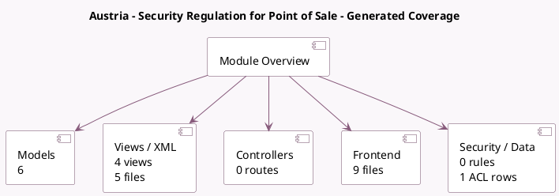

<!-- GENERATED:MODULE -->
---
tags: [odoo, enterprise, module]
---

# Austria - Security Regulation for Point of Sale

- Scope: Enterprise Addons
- Source: enterprise/l10n_at_pos
- Dependencies: [[docs/Community Addons/l10n_at/l10n_at|l10n_at]], [[docs/Community Addons/iap/iap|iap]], [[docs/Community Addons/point_of_sale/point_of_sale|point_of_sale]]

## Summary

The Austrian Cash Security Regulation

## Generated coverage

- Models: 6
- XML files with UI/data artifacts: 5
- Views: 4
- Actions: 3
- Menus: 2
- Rules (ir.rule): 0
- Access CSV entries: 1
- Controller units: 0
- Frontend asset files: 9

## Module map

## Detail notes

- Models: [[docs/Enterprise Addons/l10n_at_pos/Models|Models]] (6)
- Views and XML: [[docs/Enterprise Addons/l10n_at_pos/Views|Views]] (5 files)
- Frontend: [[docs/Enterprise Addons/l10n_at_pos/Frontend|Frontend]] (9 files)

## Key models

- `pos.config`
- `pos.fiskaly.details.wizard`
- `pos.order`
- `pos.session`
- `report.l10n_at_pos.report_config_audit_template`
- `res.company`

## Navigation

- [[../Enterprise Addons/Enterprise Addons|Back to scope]]
- [[../../docs/docs|Back to docs]]

<!-- GENERATED:MODULE -->

