<!-- GENERATED:MODEL -->
---
tags: [odoo, enterprise, generated, model]
---

# hr.employee

- Module: [[docs/Enterprise Addons/l10n_au_hr_payroll/l10n_au_hr_payroll|l10n_au_hr_payroll]]
- Scope: Enterprise Addons
- Defined in module: extension only
- Source files: `models/hr_employee.py`
- Python classes: `HrEmployee`

## Field footprint

- Detected fields: 47
- Field types: `Binary` x 1, `Boolean` x 5, `Char` x 7, `Float` x 13, `Integer` x 1, `Many2many` x 1, `Many2one` x 1, `Monetary` x 2, `One2many` x 1, `Selection` x 14, `Text` x 1
- Relation fields: 3

## Sample fields

- `l10n_au_abn`: `Char` (compute `_compute_l10n_au_abn`, store `True`)
- `l10n_au_additional_withholding_amount`: `Monetary` (related `version_id.l10n_au_additional_withholding_amount`)
- `l10n_au_casual_loading`: `Float` (related `version_id.l10n_au_casual_loading`)
- `l10n_au_cessation_type_code`: `Selection` (related `version_id.l10n_au_cessation_type_code`)
- `l10n_au_child_support_deduction`: `Float` (related `version_id.l10n_au_child_support_deduction`)
- `l10n_au_child_support_garnishee_amount`: `Float` (related `version_id.l10n_au_child_support_garnishee_amount`)
- `l10n_au_comissioners_installment_rate`: `Float` (related `version_id.l10n_au_comissioners_installment_rate`)
- `l10n_au_eligible_for_leave_loading`: `Boolean` (related `version_id.l10n_au_eligible_for_leave_loading`)
- `l10n_au_employment_basis_code`: `Selection` (related `version_id.l10n_au_employment_basis_code`)
- `l10n_au_extra_compulsory_super`: `Float` (related `version_id.l10n_au_extra_compulsory_super`)
- `l10n_au_extra_negotiated_super`: `Float` (related `version_id.l10n_au_extra_negotiated_super`)
- `l10n_au_extra_pay`: `Boolean` (related `version_id.l10n_au_extra_pay`)
- `l10n_au_income_stream_type`: `Selection` (related `version_id.l10n_au_income_stream_type`)
- `l10n_au_leave_loading`: `Selection` (related `version_id.l10n_au_leave_loading`)
- `l10n_au_leave_loading_leave_types`: `Many2many` (related `version_id.l10n_au_leave_loading_leave_types`)
- `l10n_au_leave_loading_rate`: `Float` (related `version_id.l10n_au_leave_loading_rate`)
- `l10n_au_less_than_3_performance`: `Boolean` (related `version_id.l10n_au_less_than_3_performance`)
- `l10n_au_medicare_exemption`: `Selection` (related `version_id.l10n_au_medicare_exemption`)
- `l10n_au_medicare_reduction`: `Selection` (related `version_id.l10n_au_medicare_reduction`)
- `l10n_au_medicare_surcharge`: `Selection` (related `version_id.l10n_au_medicare_surcharge`)

## Method hints

- Detected methods: 7
- Action methods: none
- Compute methods: `_compute_l10n_au_abn`, `_compute_payroll_id`, `_compute_proportion_warnings`
- Onchange methods: none

## Direct relation diagram

```plantuml
@startuml
!define ODOO_COLOR_PRIMARY #714B67
!define ODOO_COLOR_ACCENT #875A7B
!define ODOO_COLOR_BG #FAF7FA

skinparam backgroundColor ODOO_COLOR_BG
skinparam defaultTextAlignment left
skinparam ArrowColor ODOO_COLOR_ACCENT
skinparam ClassBackgroundColor white
skinparam ClassBorderColor ODOO_COLOR_PRIMARY
skinparam ComponentBackgroundColor white
skinparam ComponentBorderColor ODOO_COLOR_PRIMARY
skinparam NoteBackgroundColor #FFF8FF
skinparam NoteBorderColor ODOO_COLOR_ACCENT
skinparam SequenceLifeLineBorderColor ODOO_COLOR_ACCENT
skinparam SequenceLifeLineBackgroundColor #FFFFFF
skinparam SequenceParticipantBorderColor ODOO_COLOR_PRIMARY
skinparam SequenceParticipantBackgroundColor #FFFFFF
skinparam sequence {
  ArrowColor ODOO_COLOR_ACCENT
  ActorBorderColor ODOO_COLOR_PRIMARY
}
title hr.employee - Direct Relations
class "hr.employee" as hr_employee
class "l10n_au.super.account" as l10n_au_super_account
hr_employee --|> l10n_au_super_account : l10n_au_super_account_ids
@enduml
```

## Navigation

- **Parent:** [[docs/Enterprise Addons/l10n_au_hr_payroll/Models]]

<!-- GENERATED:MODEL -->
