<!-- GENERATED:MODEL -->
---
tags: [odoo, enterprise, generated, model]
---

# hr.payslip.input.type

- Module: [[docs/Enterprise Addons/l10n_au_hr_payroll/l10n_au_hr_payroll|l10n_au_hr_payroll]]
- Scope: Enterprise Addons
- Defined in module: extension only
- Source files: `models/hr_payslip_input_type.py`
- Python classes: `HrPayslipInputType`

## Field footprint

- Detected fields: 11
- Field types: `Boolean` x 2, `Many2one` x 1, `Monetary` x 1, `Selection` x 7
- Relation fields: 1

## Sample fields

- `currency_id`: `Many2one` (comodel `res.currency`)
- `l10n_au_default_amount`: `Monetary`
- `l10n_au_etp_type`: `Selection`
- `l10n_au_input_uom`: `Selection`
- `l10n_au_paygw_treatment`: `Selection`
- `l10n_au_payment_type`: `Selection`
- `l10n_au_payroll_code`: `Selection`
- `l10n_au_payroll_code_description`: `Selection`
- `l10n_au_quantity`: `Boolean`
- `l10n_au_requires_details`: `Boolean`
- `l10n_au_superannuation_treatment`: `Selection`

## Method hints

- Detected methods: 0
- Action methods: none
- Compute methods: none
- Onchange methods: none

## Direct relation diagram

```plantuml
@startuml
!define ODOO_COLOR_PRIMARY #714B67
!define ODOO_COLOR_ACCENT #875A7B
!define ODOO_COLOR_BG #FAF7FA

skinparam backgroundColor ODOO_COLOR_BG
skinparam defaultTextAlignment left
skinparam ArrowColor ODOO_COLOR_ACCENT
skinparam ClassBackgroundColor white
skinparam ClassBorderColor ODOO_COLOR_PRIMARY
skinparam ComponentBackgroundColor white
skinparam ComponentBorderColor ODOO_COLOR_PRIMARY
skinparam NoteBackgroundColor #FFF8FF
skinparam NoteBorderColor ODOO_COLOR_ACCENT
skinparam SequenceLifeLineBorderColor ODOO_COLOR_ACCENT
skinparam SequenceLifeLineBackgroundColor #FFFFFF
skinparam SequenceParticipantBorderColor ODOO_COLOR_PRIMARY
skinparam SequenceParticipantBackgroundColor #FFFFFF
skinparam sequence {
  ArrowColor ODOO_COLOR_ACCENT
  ActorBorderColor ODOO_COLOR_PRIMARY
}
title hr.payslip.input.type - Direct Relations
class "hr.payslip.input.type" as hr_payslip_input_type
class "res.currency" as res_currency
hr_payslip_input_type --> res_currency : currency_id
@enduml
```

## Navigation

- **Parent:** [[docs/Enterprise Addons/l10n_au_hr_payroll/Models]]

<!-- GENERATED:MODEL -->
