<!-- GENERATED:MODEL -->
---
tags: [odoo, enterprise, generated, model]
---

# hr.payslip

- Module: [[docs/Enterprise Addons/l10n_au_hr_payroll/l10n_au_hr_payroll|l10n_au_hr_payroll]]
- Scope: Enterprise Addons
- Defined in module: extension only
- Source files: `models/hr_payslip.py`
- Python classes: `HrPayslip`

## Field footprint

- Detected fields: 11
- Field types: `Float` x 6, `Json` x 1, `One2many` x 1, `Selection` x 3
- Relation fields: 1

## Sample fields

- `l10n_au_exempt_foreign_income`: `Float`
- `l10n_au_extra_compulsory_super`: `Float` (compute `_compute_l10n_au_extra_compulsory_super`, store `True`)
- `l10n_au_extra_negotiated_super`: `Float` (compute `_compute_l10n_au_extra_negotiated_super`, store `True`)
- `l10n_au_foreign_tax_withheld`: `Float`
- `l10n_au_income_stream_type`: `Selection` (compute `_compute_income_stream_type`, store `True`)
- `l10n_au_other_input_details_ids`: `One2many` (comodel `l10n_au.hr.input.details`)
- `l10n_au_salary_sacrifice_other`: `Float` (compute `_compute_l10n_au_salary_sacrifice_other`, store `True`)
- `l10n_au_salary_sacrifice_superannuation`: `Float` (compute `_compute_l10n_au_salary_sacrifice_superannuation`, store `True`)
- `l10n_au_schedule_pay`: `Selection` (related `version_id.schedule_pay`, store `True`)
- `l10n_au_termination_type`: `Selection`
- `payslip_ytd_totals`: `Json` (compute `_compute_payslip_ytd_totals`)

## Method hints

- Detected methods: 46
- Action methods: `action_refresh_from_work_entries`
- Compute methods: `_compute_income_stream_type`, `_compute_input_line_ids`, `_compute_l10n_au_extra_compulsory_super`, `_compute_l10n_au_extra_negotiated_super`, `_compute_l10n_au_salary_sacrifice_other`, `_compute_l10n_au_salary_sacrifice_superannuation`, `_compute_payslip_ytd_totals`
- Onchange methods: none

## Direct relation diagram

```plantuml
@startuml
!define ODOO_COLOR_PRIMARY #714B67
!define ODOO_COLOR_ACCENT #875A7B
!define ODOO_COLOR_BG #FAF7FA

skinparam backgroundColor ODOO_COLOR_BG
skinparam defaultTextAlignment left
skinparam ArrowColor ODOO_COLOR_ACCENT
skinparam ClassBackgroundColor white
skinparam ClassBorderColor ODOO_COLOR_PRIMARY
skinparam ComponentBackgroundColor white
skinparam ComponentBorderColor ODOO_COLOR_PRIMARY
skinparam NoteBackgroundColor #FFF8FF
skinparam NoteBorderColor ODOO_COLOR_ACCENT
skinparam SequenceLifeLineBorderColor ODOO_COLOR_ACCENT
skinparam SequenceLifeLineBackgroundColor #FFFFFF
skinparam SequenceParticipantBorderColor ODOO_COLOR_PRIMARY
skinparam SequenceParticipantBackgroundColor #FFFFFF
skinparam sequence {
  ArrowColor ODOO_COLOR_ACCENT
  ActorBorderColor ODOO_COLOR_PRIMARY
}
title hr.payslip - Direct Relations
class "hr.payslip" as hr_payslip
class "l10n_au.hr.input.details" as l10n_au_hr_input_details
hr_payslip --|> l10n_au_hr_input_details : l10n_au_other_input_details_ids
@enduml
```

## Navigation

- **Parent:** [[docs/Enterprise Addons/l10n_au_hr_payroll/Models]]

<!-- GENERATED:MODEL -->
