<!-- GENERATED:MODEL -->
---
tags: [odoo, enterprise, generated, model]
---

# hr.version

- Module: [[docs/Enterprise Addons/l10n_au_hr_payroll/l10n_au_hr_payroll|l10n_au_hr_payroll]]
- Scope: Enterprise Addons
- Defined in module: extension only
- Source files: `models/hr_version.py`
- Python classes: `HrVersion`

## Field footprint

- Detected fields: 41
- Field types: `Boolean` x 5, `Char` x 2, `Float` x 13, `Integer` x 1, `Many2many` x 1, `Many2one` x 1, `Monetary` x 4, `Selection` x 14
- Relation fields: 2

## Sample fields

- `hourly_wage`: `Monetary` (compute `_compute_hourly_wage`, store `True`)
- `l10n_au_additional_withholding_amount`: `Monetary`
- `l10n_au_casual_loading`: `Float`
- `l10n_au_cessation_type_code`: `Selection`
- `l10n_au_child_support_deduction`: `Float`
- `l10n_au_child_support_garnishee_amount`: `Float`
- `l10n_au_comissioners_installment_rate`: `Float`
- `l10n_au_eligible_for_leave_loading`: `Boolean`
- `l10n_au_employment_basis_code`: `Selection`
- `l10n_au_extra_compulsory_super`: `Float`
- `l10n_au_extra_negotiated_super`: `Float`
- `l10n_au_extra_pay`: `Boolean`
- `l10n_au_income_stream_type`: `Selection` (compute `_compute_l10n_au_income_stream_type`, store `True`)
- `l10n_au_leave_loading`: `Selection`
- `l10n_au_leave_loading_leave_types`: `Many2many` (comodel `hr.leave.type`)
- `l10n_au_leave_loading_rate`: `Float`
- `l10n_au_less_than_3_performance`: `Boolean`
- `l10n_au_medicare_exemption`: `Selection`
- `l10n_au_medicare_reduction`: `Selection` (compute `_compute_l10n_au_medicare_reduction`, store `True`)
- `l10n_au_medicare_surcharge`: `Selection`

## Method hints

- Detected methods: 21
- Action methods: none
- Compute methods: `_compute_hourly_wage`, `_compute_l10n_au_income_stream_type`, `_compute_l10n_au_medicare_reduction`, `_compute_l10n_au_tax_treatment_code`, `_compute_l10n_au_tfn`, `_compute_wage`, `_compute_yearly_wage`
- Onchange methods: none

## Direct relation diagram

```plantuml
@startuml
!define ODOO_COLOR_PRIMARY #714B67
!define ODOO_COLOR_ACCENT #875A7B
!define ODOO_COLOR_BG #FAF7FA

skinparam backgroundColor ODOO_COLOR_BG
skinparam defaultTextAlignment left
skinparam ArrowColor ODOO_COLOR_ACCENT
skinparam ClassBackgroundColor white
skinparam ClassBorderColor ODOO_COLOR_PRIMARY
skinparam ComponentBackgroundColor white
skinparam ComponentBorderColor ODOO_COLOR_PRIMARY
skinparam NoteBackgroundColor #FFF8FF
skinparam NoteBorderColor ODOO_COLOR_ACCENT
skinparam SequenceLifeLineBorderColor ODOO_COLOR_ACCENT
skinparam SequenceLifeLineBackgroundColor #FFFFFF
skinparam SequenceParticipantBorderColor ODOO_COLOR_PRIMARY
skinparam SequenceParticipantBackgroundColor #FFFFFF
skinparam sequence {
  ArrowColor ODOO_COLOR_ACCENT
  ActorBorderColor ODOO_COLOR_PRIMARY
}
title hr.version - Direct Relations
class "hr.version" as hr_version
class "hr.leave.type" as hr_leave_type
class "res.country" as res_country
hr_version --> res_country : l10n_au_work_country_id
hr_version .. hr_leave_type : l10n_au_leave_loading_leave_types
@enduml
```

## Navigation

- **Parent:** [[docs/Enterprise Addons/l10n_au_hr_payroll/Models]]

<!-- GENERATED:MODEL -->
