<!-- GENERATED:MODEL -->
---
tags: [odoo, enterprise, generated, model]
---

# l10n_au.hr.input.details

- Module: [[docs/Enterprise Addons/l10n_au_hr_payroll/l10n_au_hr_payroll|l10n_au_hr_payroll]]
- Scope: Enterprise Addons
- Defined in module: yes
- Source files: `models/l10n_au_hr_input_details.py`
- Python classes: `L10n_AuHrInputDetails`
- Description: Other Input Details

## Field footprint

- Detected fields: 12
- Field types: `Boolean` x 1, `Char` x 2, `Date` x 1, `Float` x 2, `Many2one` x 5, `Selection` x 1
- Relation fields: 5

## Sample fields

- `city_id`: `Many2one` (comodel `res.city`)
- `code`: `Char` (related `input_id.code`)
- `country_id`: `Many2one` (comodel `res.country`)
- `date`: `Date`
- `input_id`: `Many2one` (comodel `hr.payslip.input`)
- `input_type_id`: `Many2one` (related `input_id.input_type_id`)
- `input_uom`: `Selection` (related `input_id.input_type_id.l10n_au_input_uom`)
- `is_backpayment`: `Boolean` (compute `_compute_is_backpayment`)
- `name`: `Char` (compute `_compute_name`)
- `payslip_id`: `Many2one` (related `input_id.payslip_id`, store `True`)
- `quantity`: `Float`
- `rate`: `Float` (compute `_compute_rate`, store `True`)

## Method hints

- Detected methods: 7
- Action methods: none
- Compute methods: `_compute_is_backpayment`, `_compute_name`, `_compute_rate`
- Onchange methods: `_onchange_input_uom`

## Direct relation diagram

```plantuml
@startuml
!define ODOO_COLOR_PRIMARY #714B67
!define ODOO_COLOR_ACCENT #875A7B
!define ODOO_COLOR_BG #FAF7FA

skinparam backgroundColor ODOO_COLOR_BG
skinparam defaultTextAlignment left
skinparam ArrowColor ODOO_COLOR_ACCENT
skinparam ClassBackgroundColor white
skinparam ClassBorderColor ODOO_COLOR_PRIMARY
skinparam ComponentBackgroundColor white
skinparam ComponentBorderColor ODOO_COLOR_PRIMARY
skinparam NoteBackgroundColor #FFF8FF
skinparam NoteBorderColor ODOO_COLOR_ACCENT
skinparam SequenceLifeLineBorderColor ODOO_COLOR_ACCENT
skinparam SequenceLifeLineBackgroundColor #FFFFFF
skinparam SequenceParticipantBorderColor ODOO_COLOR_PRIMARY
skinparam SequenceParticipantBackgroundColor #FFFFFF
skinparam sequence {
  ArrowColor ODOO_COLOR_ACCENT
  ActorBorderColor ODOO_COLOR_PRIMARY
}
title l10n_au.hr.input.details - Direct Relations
class "l10n_au.hr.input.details" as l10n_au_hr_input_details
class "hr.payslip.input" as hr_payslip_input
class "res.city" as res_city
class "res.country" as res_country
l10n_au_hr_input_details --> hr_payslip_input : input_id
l10n_au_hr_input_details --> res_city : city_id
l10n_au_hr_input_details --> res_country : country_id
@enduml
```

## Navigation

- **Parent:** [[docs/Enterprise Addons/l10n_au_hr_payroll/Models]]

<!-- GENERATED:MODEL -->
