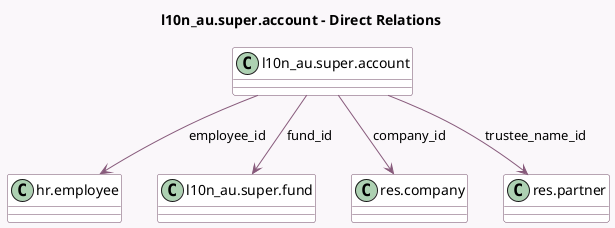

<!-- GENERATED:MODEL -->
---
tags: [odoo, enterprise, generated, model]
---

# l10n_au.super.account

- Module: [[docs/Enterprise Addons/l10n_au_hr_payroll/l10n_au_hr_payroll|l10n_au_hr_payroll]]
- Scope: Enterprise Addons
- Defined in module: yes
- Source files: `models/l10n_au_super_account.py`
- Python classes: `L10n_AuSuperAccount`
- Description: Super Account

## Field footprint

- Detected fields: 14
- Field types: `Boolean` x 1, `Char` x 4, `Date` x 1, `Float` x 1, `Many2one` x 4, `Selection` x 2, `Text` x 1
- Relation fields: 4

## Sample fields

- `account_active`: `Boolean` (comodel `Active`)
- `company_id`: `Many2one` (comodel `res.company`, related `employee_id.company_id`, store `True`)
- `date_from`: `Date`
- `display_name`: `Char`
- `employee_id`: `Many2one` (comodel `hr.employee`)
- `employee_tfn`: `Char` (related `employee_id.l10n_au_tfn`)
- `fund_abn`: `Char` (related `fund_id.abn`)
- `fund_id`: `Many2one` (comodel `l10n_au.super.fund`)
- `fund_type`: `Selection` (related `fund_id.fund_type`)
- `member_nbr`: `Char`
- `proportion`: `Float` (comodel `Proportion`)
- `super_account_warning`: `Text` (related `employee_id.super_account_warning`)
- `trustee`: `Selection`
- `trustee_name_id`: `Many2one` (comodel `res.partner`)

## Method hints

- Detected methods: 1
- Action methods: none
- Compute methods: `_compute_display_name`
- Onchange methods: none

## Direct relation diagram

## Navigation

- **Parent:** [[docs/Enterprise Addons/l10n_au_hr_payroll/Models]]

<!-- GENERATED:MODEL -->
