<!-- GENERATED:MODEL -->
---
tags: [odoo, enterprise, generated, model]
---

# l10n_au.termination.payment

- Module: [[docs/Enterprise Addons/l10n_au_hr_payroll/l10n_au_hr_payroll|l10n_au_hr_payroll]]
- Scope: Enterprise Addons
- Defined in module: yes
- Source files: `wizards/l10n_au_termination_payment.py`
- Python classes: `L10n_AuTerminationPayment`
- Description: Termination Payment

## Field footprint

- Detected fields: 7
- Field types: `Date` x 1, `Float` x 2, `Many2one` x 2, `Selection` x 2
- Relation fields: 2

## Sample fields

- `cessation_type_code`: `Selection`
- `contract_end_date`: `Date` (comodel `Contract End Date`)
- `employee_id`: `Many2one` (comodel `hr.employee`)
- `termination_type`: `Selection`
- `unused_annual_leaves`: `Float` (compute `_compute_unused_leaves`)
- `unused_long_service_leaves`: `Float` (compute `_compute_unused_leaves`)
- `version_id`: `Many2one` (comodel `hr.version`, compute `_compute_contract_id`)

## Method hints

- Detected methods: 5
- Action methods: none
- Compute methods: `_compute_contract_id`, `_compute_unused_leaves`
- Onchange methods: none

## Direct relation diagram

```plantuml
@startuml
!define ODOO_COLOR_PRIMARY #714B67
!define ODOO_COLOR_ACCENT #875A7B
!define ODOO_COLOR_BG #FAF7FA

skinparam backgroundColor ODOO_COLOR_BG
skinparam defaultTextAlignment left
skinparam ArrowColor ODOO_COLOR_ACCENT
skinparam ClassBackgroundColor white
skinparam ClassBorderColor ODOO_COLOR_PRIMARY
skinparam ComponentBackgroundColor white
skinparam ComponentBorderColor ODOO_COLOR_PRIMARY
skinparam NoteBackgroundColor #FFF8FF
skinparam NoteBorderColor ODOO_COLOR_ACCENT
skinparam SequenceLifeLineBorderColor ODOO_COLOR_ACCENT
skinparam SequenceLifeLineBackgroundColor #FFFFFF
skinparam SequenceParticipantBorderColor ODOO_COLOR_PRIMARY
skinparam SequenceParticipantBackgroundColor #FFFFFF
skinparam sequence {
  ArrowColor ODOO_COLOR_ACCENT
  ActorBorderColor ODOO_COLOR_PRIMARY
}
title l10n_au.termination.payment - Direct Relations
class "l10n_au.termination.payment" as l10n_au_termination_payment
class "hr.employee" as hr_employee
class "hr.version" as hr_version
l10n_au_termination_payment --> hr_employee : employee_id
l10n_au_termination_payment --> hr_version : version_id
@enduml
```

## Navigation

- **Parent:** [[docs/Enterprise Addons/l10n_au_hr_payroll/Models]]

<!-- GENERATED:MODEL -->
