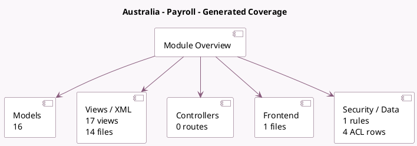

<!-- GENERATED:MODULE -->
---
tags: [odoo, enterprise, module]
---

# Australia - Payroll

- Scope: Enterprise Addons
- Source: enterprise/l10n_au_hr_payroll
- Dependencies: [[docs/Enterprise Addons/hr_payroll/hr_payroll|hr_payroll]], [[docs/Community Addons/hr_work_entry_holidays/hr_work_entry_holidays|hr_work_entry_holidays]], [[docs/Enterprise Addons/hr_payroll_holidays/hr_payroll_holidays|hr_payroll_holidays]], [[docs/Community Addons/base_address_extended/base_address_extended|base_address_extended]]

## Generated coverage

- Models: 16
- XML files with UI/data artifacts: 14
- Views: 17
- Actions: 4
- Menus: 5
- Rules (ir.rule): 1
- Access CSV entries: 4
- Controller units: 0
- Frontend asset files: 1

## Module map

## Detail notes

- Models: [[docs/Enterprise Addons/l10n_au_hr_payroll/Models|Models]] (16)
- Views and XML: [[docs/Enterprise Addons/l10n_au_hr_payroll/Views|Views]] (14 files)
- Frontend: [[docs/Enterprise Addons/l10n_au_hr_payroll/Frontend|Frontend]] (1 files)

## Key models

- `hr.employee`
- `hr.leave.type`
- `hr.payroll.structure`
- `hr.payroll.structure.type`
- `hr.payslip`
- `hr.payslip.input`
- `hr.payslip.input.type`
- `hr.payslip.worked_days`
- `hr.version`
- `hr.work.entry.type`
- `l10n_au.hr.input.details`
- `l10n_au.super.account`

## Navigation

- [[../Enterprise Addons/Enterprise Addons|Back to scope]]
- [[../../docs/docs|Back to docs]]

<!-- GENERATED:MODULE -->

