<!-- GENERATED:MODEL -->
---
tags: [odoo, enterprise, generated, model]
---

# hr.payroll.payment.report.wizard

- Module: [[docs/Enterprise Addons/l10n_au_hr_payroll_account/l10n_au_hr_payroll_account|l10n_au_hr_payroll_account]]
- Scope: Enterprise Addons
- Defined in module: extension only
- Source files: `wizard/hr_payroll_report_wizard.py`
- Python classes: `HrPayrollPaymentReportWizard`

## Field footprint

- Detected fields: 2
- Field types: `Many2one` x 1, `Selection` x 1
- Relation fields: 1

## Sample fields

- `export_format`: `Selection`
- `journal_id`: `Many2one` (comodel `account.journal`)

## Method hints

- Detected methods: 3
- Action methods: none
- Compute methods: none
- Onchange methods: none

## Direct relation diagram

```plantuml
@startuml
!define ODOO_COLOR_PRIMARY #714B67
!define ODOO_COLOR_ACCENT #875A7B
!define ODOO_COLOR_BG #FAF7FA

skinparam backgroundColor ODOO_COLOR_BG
skinparam defaultTextAlignment left
skinparam ArrowColor ODOO_COLOR_ACCENT
skinparam ClassBackgroundColor white
skinparam ClassBorderColor ODOO_COLOR_PRIMARY
skinparam ComponentBackgroundColor white
skinparam ComponentBorderColor ODOO_COLOR_PRIMARY
skinparam NoteBackgroundColor #FFF8FF
skinparam NoteBorderColor ODOO_COLOR_ACCENT
skinparam SequenceLifeLineBorderColor ODOO_COLOR_ACCENT
skinparam SequenceLifeLineBackgroundColor #FFFFFF
skinparam SequenceParticipantBorderColor ODOO_COLOR_PRIMARY
skinparam SequenceParticipantBackgroundColor #FFFFFF
skinparam sequence {
  ArrowColor ODOO_COLOR_ACCENT
  ActorBorderColor ODOO_COLOR_PRIMARY
}
title hr.payroll.payment.report.wizard - Direct Relations
class "hr.payroll.payment.report.wizard" as hr_payroll_payment_report_wizard
class "account.journal" as account_journal
hr_payroll_payment_report_wizard --> account_journal : journal_id
@enduml
```

## Navigation

- **Parent:** [[docs/Enterprise Addons/l10n_au_hr_payroll_account/Models]]

<!-- GENERATED:MODEL -->
